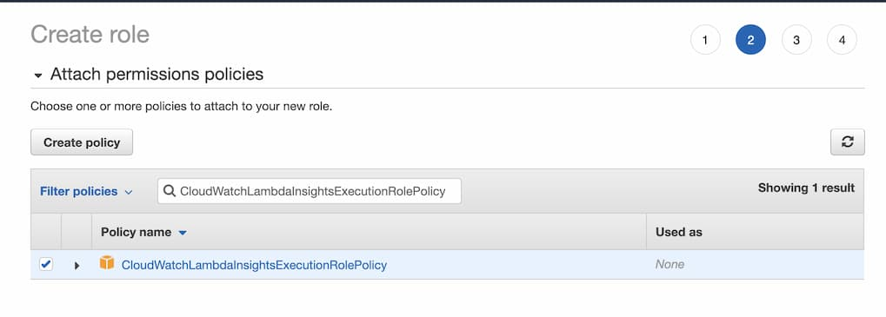

因應最近公司的需求，查了一下發現有現成的串接 Slack 頻道的 Lambda blueprint 可以用，但比較麻煩的是整個流程有用到蠻多服務的：CloudWatch、SNS、KNS、Lambda、IAM...等等，所以稍微紀錄並整理一下。
<!--truncate-->

## 架構
主要是監控 Load Balancer 的 healthy check 狀況，在健康狀態低於設定的數值時會發送 Email 與打通知到 Slack 頻道。

- 建立 Lambda Function，這邊使用一個叫 `cloudwatch-alarm-to-slack-python` 的 blueprint。
- 建立一個 SNS Topic。
- SNS Subscriptions 有兩個，一個 Protocol 設 Email、另個設 Lambda，並訂閱同一個 SNS Topic。
- 在 CloudWatch 設置 alarm 監控對應 Load Balancer 的 healthy check 狀況，警示發生時打通知到 SNS Topic。

大致上是這樣，實作上還需要 IAM 與 KMS 的設置，稍後會提到。

## 實作

### 建立 Topic

1. 至 SNS 建立 Topic
2. type 選 Standard (選 FIFO 會無法讓 Lambda 訂閱)
3. 其他不用特別設定，有特殊需求再設

### 建立 Subscriptions

目前通知設定做兩種：
1. Email
2. Lambda (打通知到 Slack Channel)

### Email
1. 至 SNS Subscriptions 新建 subscription
2. 訂閱剛剛建的 Topic
3. 選 email 通知，設置 email (只能設一個)
4. 建完後到 email 信箱收信點確認訂閱連結
5. 回 SNS Subscriptions 看 Status 應該要是 Confirmed

在建立 Lambda Function 串接 Slack Channel 之前，有些前置資源需要設置：
### 建立 Lambda 用的 IAM Role
建立 Policy
- 選 KMS 服務的 Decypct 權限就好，並建立。


建立 Role
1. 選 AWS service (這個 role 是要給 AWS service 使用)
2. 選 Lambda (這個 role 是要給 Lambda 使用)
3. Policy 選擇*剛剛建的 Policy* 與 **CloudWatchLambdaInsightsExecutionRolePolicy** (這個 Policy 是用來讓 Lambda 執行的 log 寫入 CloudWatch 記錄起來)



### 建立加密 Lambda 環境變數用的 KMS Key
1. 前面都選預設的
2. Define key administrative premissions 可略過
3. Define key usage premissions 選*剛剛建的 Role*


### Slack 設置
1. 打開 `https://<your team>.slack.com/apps` (`<your team>` 換成自己的 work space)
2. 搜尋 `Incoming Webhooks`，新增至 Slack，並選擇頻道。

3. 進到設置頁面後可以看到我們需要的 Webhook URL。

4. 取了名稱方便好辨識這是負責哪塊訊息通知的機器人，之後若有其他需求也要打通知到 Slack 頻道上，建議重複上述步驟加進頻道。每個 `Incoming Webhooks` 都會是獨立的。


### Lambda 串接 Slack WebHook
至 Lambda 建立 Function
1. 使用寫好的藍圖：搜尋 `cloudwatch-alarm-to-slack-python` 並選用。
2. Execution role 選*剛剛建的 Role*
3. SNS trigger 選*剛剛建的 Topic*
4. Lambda function code 內的註解有簡略說明整個建置流程
5. Environment variables:
   1. slackChannel: #your-channel (換成要通知至的 Slack 頻道)
   2. kmsEncryptedHookUrl: 先打開 Encryption configuration 中的 Enable helpers for encryption in transit 設置，將 Slack 的 Webhook URL 貼上後點擊 Encypt 會跳出設定介面，選擇*剛剛建的 KMS Key* 並加密，完成後可以看到原本輸入的 URL 變成加密後的字串。


6. 按下 Create Function 後就完成建立囉！

可以回到

> 筆者雖然不會 Python，但這支 Function 做的事很簡單，就接收 `event` 裡 SNS 的訊息資料，並傳至我們給定的 Webhook URL。

### CloudWatch 設置 Alarm 監控 server 運行狀況
這部分就依需求自行設定，如果是想練習的話可以先去[啟動一台 EC2](https://docs.aws.amazon.com/zh_tw/AWSEC2/latest/UserGuide/launching-instance.html)，EC2 的相關配置本文不多做敘述囉。

#### 選擇 Metric
這邊有很多可以選擇要監控哪些服務，以筆者的需求是監控 ELB，想練習的選擇 EC2 - Per-Instance Metrics。
#### 數值設置
以下以 EC2 為例 (ELB 或其他部分的操作都類似)
1. 選擇要監控哪台 EC2
2. 接著會看到圖表與條件設置畫面，以附圖為例：平均 5 分鐘內 `StatusCheckFailed_System` 的次數 (也就是 AWS 會定期去戳這台 EC2 看還有沒有正常運行著)，大於等於 1 的話，就發出通知警告。


3. 由於上面設置檢查失敗超過平均 5 分鐘 1 次時會發出警告，所以我們當然是選 `In alarm`。
4. 接著選在警告狀態時，要發通知到哪個 SNS Topic


5. 其他可以略過，取好 alarm 的名字後就可以建立囉！

## 測試
接著我們到剛建立的 Lambda Function，並點選 Test 的介面。


選擇事件模板，這邊選 SNS 的。


CloudWatch Alarm 觸發並打通知到 SNS Topic 後，Lambda 接收事件時，`Message` 會長得像這樣：

```JSON
"Message": "{\"AlarmName\":\"某某網站服務健康監測\",\"NewStateValue\":\"ALARM\",\"NewStateReason\":\"StatusCheckFailed 超過所設定的閥值\"}",
```

所以我們替換掉原本模板內的 `Message`：


然後按右上角的 TEST 按鈕，Lambda 就會執行並傳訊息至 Slack 頻道上囉！

回到 Slack 頻道上應該可以看到：


接著可以把 EC2 直接關掉看看XD，等等就會有警告訊息傳至 Slack 頻道上囉！
