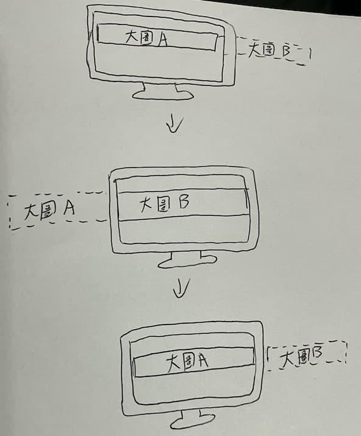

import Codepen from 'react-codepen-embed';
export const CodepenEmbedded = () => {
  return <Codepen hash="BawQRNw" user="jaosnzhuang" height={600} />;
};

某天點進寶可夢卡片的官方網站，看到他們的圖片跑馬燈就很好奇做法是什麼。檢查了一下發現沒有用到 JavaScript，而且做法也蠻有趣的。


<!--truncate-->

## 破題
他們用了三張一模一樣的大圖片串在一起，這個圖片必須要夠寬，至少要 1920px 以上(大於所有螢幕寬度)。若沒有適當的圖片也沒關係，等等會提到可以用任何圖片的方式。


接著設定 CSS 動畫，如果跑馬燈效果想要往左移動：
```css
@keyframes scroll_anim_slide_left {
  from {
    left: 0px; // 第一張圖片對齊螢幕左邊
  }

  to {
    left: -1920px; // 接著往左移動，移動的值根據圖片寬度
  }
}
```

往右移動則是：
```css
@keyframes scroll_anim_slide_right {
  from {
    right: 0px; // 最後一張圖片對齊螢幕右邊
  }

  to {
    right: -1920px; // 接著往右移動，移動的值根據圖片寬度
  }
}
```

大致上的概念是，圖片移動跟自己寬度一樣的值之後會移動到視窗之外，此時動畫會跑下一輪，這時第二張圖片的位置又會變成第一張圖片，然後繼續移動。



其實兩張圖串在一起就可以達成這個效果了，不過使用者的螢幕寬度沒辦法預測 (甚至有用電視螢幕來逛網站的)，所以最好三、四張串在一起比較保險。(寶可夢網站的圖寬有 3000px 多XD)

## 自己組出大圖
這個做法會較麻煩，若本身不會圖像相關的軟體，~~或是工作上的設計師不合作~~，可以參考看看。

做法是用 `<div>` 代替一張超寬大圖，所以一排會有三個一模一樣結構的 `<div>`。
```html
<div class="slide-item slide-animation-right">
  <div class="image">...</div>
  <div class="image">...</div>
  <div class="image">...</div>
</div>
```
```css
.image {
  flex: 0 0 auto;
  width: 1920px; // 或是設 100vw，看情況
  display: flex;
  justify-content: space-between;
  padding: 0 10px;
}
```

就像官方那樣一張大圖裡面有很多張卡片圖，我們 `<div>` 裡面也會放很多張圖：
```html
<div class="image">
  
  
  
</div>
```

## CodePen 範例

當時實作時大圖寬度只有設 900px，所以如果打開 CodePen，螢幕寬度大於筆電的話，這個範例就會露出馬腳了XD，所以還是建議大圖寬度至少 1920px 以上。
<CodepenEmbedded />

[參考網站](https://card25th.portal-pokemon.com/tw/)