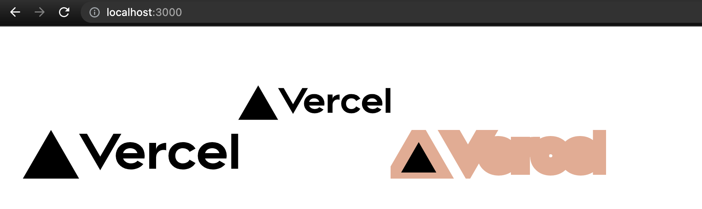

最近因應 SEO 需求在將 React 專案改成 Next 架構時在圖片相關資源踩了許多雷，許多在 React 熟悉的寫法一到 Next 可能就直接報 Error。

因此以下用 SVG 與 PNG 圖檔為例來瞭解一下在這兩個框架中使用上的差異。

<!--truncate-->

> 本文舉例皆是以 `create-react-app` 或 `create-next-app` 的 TypeScript template 建立專案，如果是自己寫 Webpack 設定或是上述兩個 CLI 有更新則可能和本文當時的範例有差異。

## 直接引入

我們準備了兩張圖片，SVG 是原有的 Logo，PNG 隨意抓張圖來放即可。

現在來改一下 React 專案的 `App.tsx`：

```ts title="App.tsx"
import React from 'react';
import './App.css';
import LogoSvg from './logo.svg'
import LogoPng from './React-icon.svg.png'

function App() {
  return (
    <div className="App">
      <p>{LogoSvg}</p>
      <p>{LogoPng}</p>
    </div>
  );
}

export default App;
```

還有 Next 專案的 `pages/index.tsx`：

```tsx title="pages/index.tsx"
import type { NextPage } from 'next'
import styles from '../styles/Home.module.css'
import LogoSvg from '../public/vercel.svg'
import LogoPng from '../public/React-icon.svg.png'

const Home: NextPage = () => {
  return (
    <div className={styles.container}>
      <p>{JSON.stringify(LogoSvg)}</p>
      <p>{JSON.stringify(LogoPng)}</p>
    </div>
  )
}

export default Home
```

先來看一下 React 這邊的型別與實際畫面：

SVG
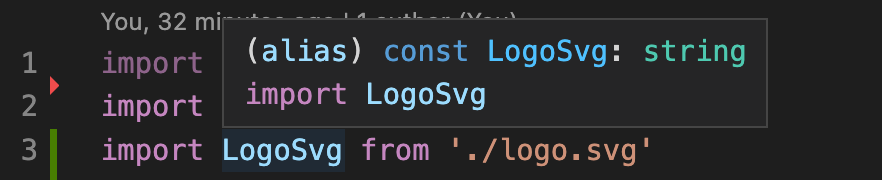

PNG
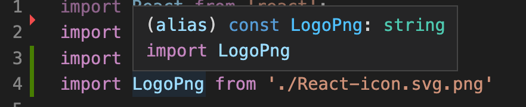

Result
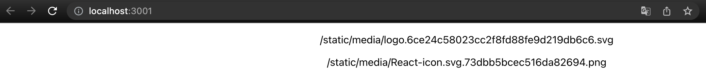

都是字串。

再來看 Next 這邊的型別與實際畫面：

SVG
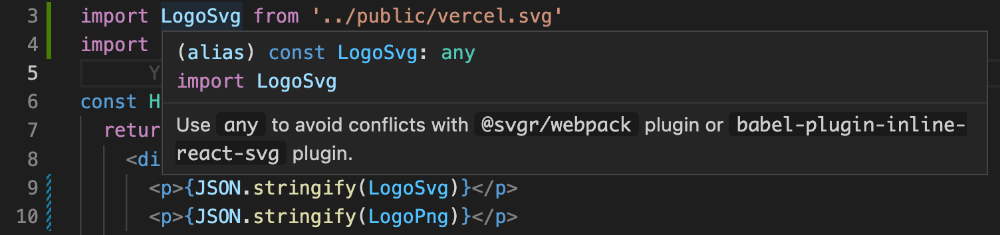

PNG
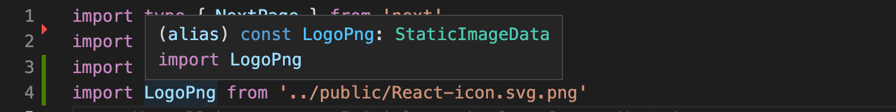

Result
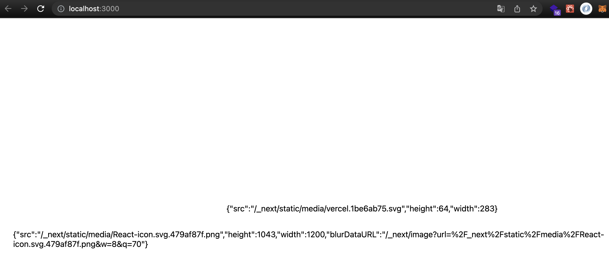

由此可知 React 內直接引入 SVG & PNG 檔案時，該變數都是單純的字串對應打包後的路徑。

Next 內引入 PNG 後變數是一個型別為 `StaticImageData` 物件，包含 `src`、`width`、`heigth` 等屬性。

SVG 型別卻是 `any`，實際上是一個很像 `StaticImageData` 的物件，看型別敘述是因為怕套件衝突才設 `any`。

所以在 Next 中使用 `img` 標籤搭配引入的圖檔時需要加上 `src` 才可以。

在 Next 專案的 `pages/index.tsx` 加上：

```diff
+ 
+ 
```

就可以正常顯示圖片：

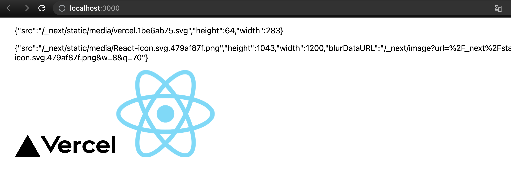

在 Next.js 中有提供 `<Image>` 的組件可以使用，若觀察此組件的 src 屬性所接受的型別，可發現 `StaticImport` 可接受 `StaticImageData`：

在 Next 專案的 `pages/index.tsx` 加上：

```diff
+ import Image from 'next/image'
...
+ <Image style={{width:'200px'}} src={LogoSvg} alt="LogoSvg" />
+ <Image style={{width:'200px'}} src={LogoPng} alt="LogoPng" />
```

`<Image>` 的組件的 src 屬性所接受的型別：

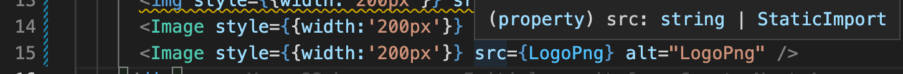

`StaticImport` 可接受 `StaticImageData`：

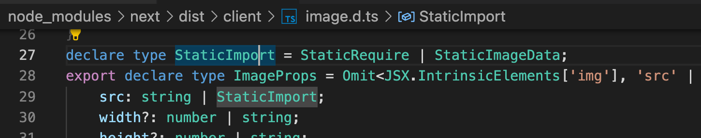

結果圖：

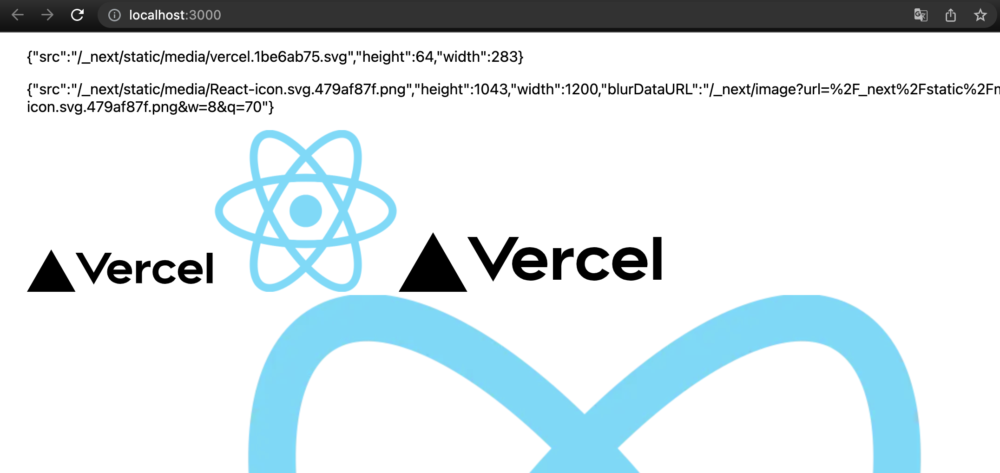

從結果圖可以發現剛設置的寬度 `200px` 沒有效果，關於這問題可以參考此 [Stack Overflow](https://stackoverflow.com/questions/65527407/next-image-not-taking-class-properties)，大意就是 `Image` 這個組件實際上是把 `img` 標籤包在其他標籤裡面，雖然 `Image` 會把接收到的樣式傳入並套用在 `img` 上，但長寬等等的屬性會被組件內部產生的屬性而被覆寫掉。所以實際上解法可以在 `Image` 外自己包一層 wrapper 用途的元素去限制大小。

到這邊直接引用路徑的問題解決了，那麽使用 SVG Component 的情況呢？

## SVG Component

在 React 專案中可以使用以下語法來引入一個 SVG Component：

```tsx
import { ReactComponent as LogoSvgComponent } from './logo.svg'
```

這多虧了此專案有用到 `@svgr/webpack` 這個套件來處理，讓我們能直接引入 SVG 檔作為一個組件。

接著就可以直接操作此 SVG Component 囉!

```tsx
<LogoSvgComponent className="logo" stroke="#EAAA90" strokeWidth="1rem"/>
```

在 Next 專案中同樣語法則會報錯：

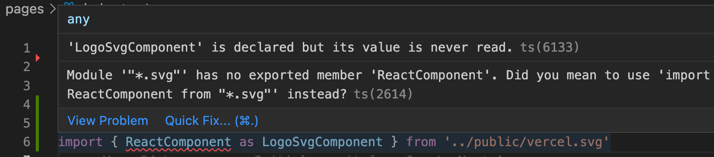

因此我們需要自己安裝 `@svgr/webpack` 來處理：

```bash
yarn add --dev @svgr/webpack
```

並在 `next.config.js` 中寫上 Webpack 設定：

```js title="next.config.js"
/** @type {import('next').NextConfig} */

const nextConfig = {
  reactStrictMode: true,

  webpack(config) {
    config.module.rules.push({
      test: /\.svg$/i,
      use: ['@svgr/webpack']
    });
    return config;
  }
}

module.exports = nextConfig
```

上述會將引入的 SVG 檔案解析成 Component。

也因為引入後的 SVG 變數就不會是有 `src` 屬性的 `StaticImageData` 物件了，所以先把 Image 的部分都先註解。

```tsx title="page/index.tsx"
import type { NextPage } from 'next'
import Image from 'next/image'
import styles from '../styles/Home.module.css'
import LogoSvg from '../public/vercel.svg'
import LogoPng from '../public/React-icon.svg.png'

const Home: NextPage = () => {
  return (
    <div className={styles.container}>
      <p>{JSON.stringify(LogoSvg)}</p>
      <p>{JSON.stringify(LogoPng)}</p>
      {/*  */}
      {/*  */}
      {/* <Image style={{width:'200px'}} src={LogoSvg} alt="LogoSvg" /> */}
      {/* <Image style={{width:'200px'}} src={LogoPng} alt="LogoPng" /> */}
      <LogoSvg className="logo" stroke="#EAAA90" strokeWidth="1rem" />
    </div>
  )
}

export default Home
```

然後就可以直接使用，結果會是這樣： (`strokeWidth` 太粗 XD)

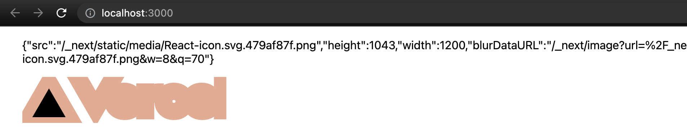

## 在 Next.js 同時使用 SVG Component 與 Asset Path

推薦直接看 [`@svgr/webpack` 官方文檔](https://react-svgr.com/docs/webpack/#use-svgr-and-asset-svg-in-the-same-project)，有兩個方法。

其中明確說明 `url-loader` 與 `file-loader` 在 Webpack v5 被棄用，所以建議使用 `resourceQuery` 的方法。

根據官方推薦的 `resourceQuery` 方法，改寫一下 `next.config.js` 的 Webpack 設定：

```js title="next.config.js"
...
webpack( config ) {
  config.module.rules.push( {
    test: /\.svg$/i,
    issuer: /\.[jt]sx?$/,
    resourceQuery: { not: [ /url/ ] }, // exclude react component if *.svg?url
    use: [ '@svgr/webpack' ],
  }, {
    test: /\.svg$/i,
    type: 'asset',
    resourceQuery: /url/, // *.svg?url
  } );

  return config;
}
...
```

以上主要是將路徑是 `*.svg?url` 的檔案解析成 Asset

接著我們在 `pages/index.tsx` 加上：

```diff
+ import LogoSvgUrl from '../public/vercel.svg?url'
```

然後就會報錯 XD：

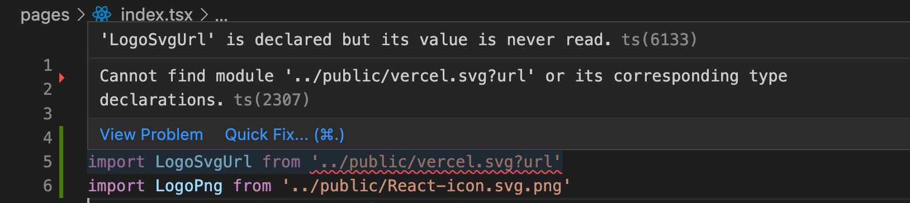

根據錯誤訊息，我們需要定義此 module 的型別。

我們新增一個 `global.d.ts` 檔案並寫上：

```ts title="global.d.ts"
declare module '*.svg?url' {
  const defaultExport: string;
  export default defaultExport;
}
```

將此路徑解析的結果設定為字串型別。

接著在 `pages/index.tsx` 加上：

```diff
+ <p>{LogoSvgUrl}</p>
+ 
```

結果如下圖：

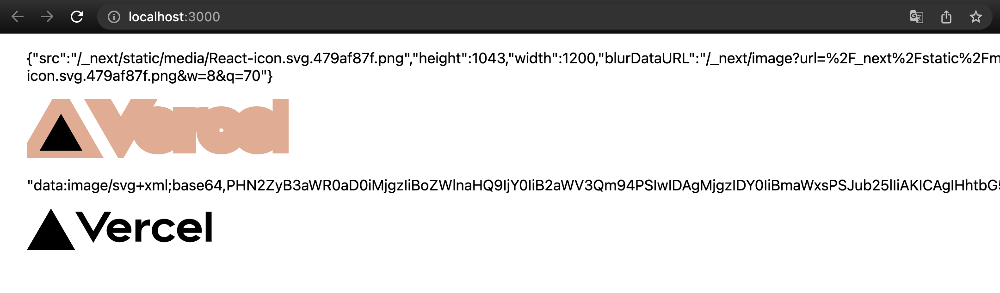

我們可以看到引入後實際上是 Base64 的字串。

但如果使用到 Next 內建的 `<Image>` 組件的話：

```diff
+ <Image src={LogoSvgUrl} alt="LogoPng" />
```

則會因為缺少長寬設定而報錯：

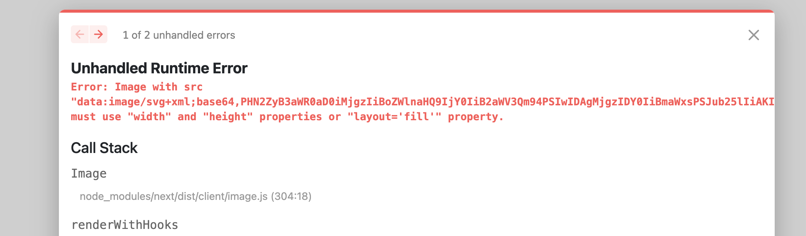

這時依照錯誤訊息指示補上長寬或 `layout='fill'` 即可：

```diff
- <Image src={LogoSvgUrl} alt="LogoPng" />
+ <Image src={LogoSvgUrl} alt="LogoPng" width="200" height="200" />
```

到這邊雖然能在 Nextjs 使用引入 SVG Component 與 SVG Asset，但使用上與檔案解析跟使用 React 時有落差：

1. 要用做 Asset 引入 SVG 得要在路徑後面加 `?url` 。
2. 以 Asset 引入 SVG 後實際上得到的是 Base64 字串，與在 React 得到的打包後路徑字串不一樣。

## 優化 - 在 Next 使用 SVG 方式與在 React 一樣

為了達成標題的目的，找了下 Create React App 的 [source code](https://github.com/facebook/create-react-app/blob/main/packages/react-scripts/config/webpack.config.js#L392)，參考他們 Webpack 打包時的設定。

他們處理 SVG 的設定其實就是 [`@svgr/webpack` 官方文檔](https://react-svgr.com/docs/webpack/#use-svgr-and-asset-svg-in-the-same-project) 中提到因為 `url-loader` 與 `file-loader` 在 Webpack v5 被棄用所以較不推薦的方法。

至於 SVG module type 設定在 React 中如下圖，等等我們需要這段：

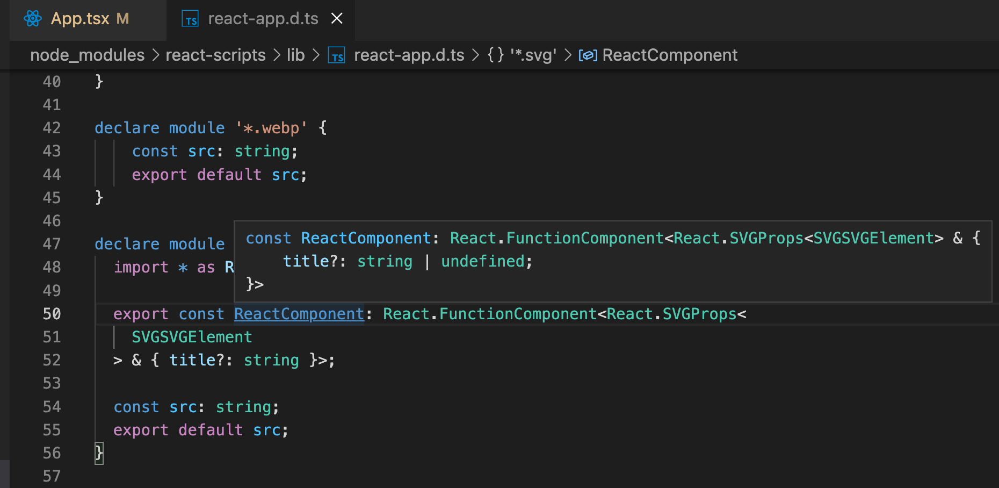

接著實作，先安裝 file-loader (記得 `@svgr/webpack` 也要裝)

```bash
yarn add --dev file-loader
```

將 `global.d.ts` 改成：

```ts title="global.d.ts"
declare module '*.svg' {
  import * as React from 'react';

  export const ReactComponent: React.FunctionComponent<React.SVGProps<
    SVGSVGElement
  > & { title?: string }>;

  const src: string;
  export default src;
}
```

我們把 Next 專案的 `pages/index.tsx` 改成：

```tsx title="pages/index.tsx"
import type { NextPage } from 'next'
import Image from 'next/image'
import styles from '../styles/Home.module.css'
import logoSvg, { ReactComponent as LogoSvg } from '../public/vercel.svg'

const Home: NextPage = () => {
  return (
    <div className={styles.container}>
      
      <Image src={logoSvg} alt="logoSvg" width={200} height={200} />
      <LogoSvg className="logo" stroke="#EAAA90" strokeWidth="1rem" />
    </div>
  )
}

export default Home
```

結果如圖：


需要注意 `<Image>` 若不是 `StaticImageData` 的物件的話，必須要加長寬或 `layout='fill'` 的設定。

到這邊算是讓兩邊在使用 SVG 的體驗上一致了。

但因為 Next 本身對於圖檔的處理邏輯本身就和 React 不一樣，所以最後再調整另個版本：直接引入 SVG 的話就會是 `StaticImageData` 物件以保持 Next 原本的邏輯。

## 優化 Final - 在 Next 中使用 SVG Component 且不影響原本引入邏輯

首先將 SVG module 型別保留 `ReactComponent`：

```ts title="global.d.ts"
declare module '*.svg' {
  import * as React from 'react';

  export const ReactComponent: React.FunctionComponent<React.SVGProps<
    SVGSVGElement
  > & { title?: string }>;
}
```

Webpack 設定部分改成：

```js title="next-config.js"
/** @type {import('next').NextConfig} */

const nextConfig = {
  reactStrictMode: true,
  webpack( config ) {
    config.module.rules.push( {
      test: /\.svg$/,
      issuer: /\.(ts|tsx|js|jsx)$/,
      use: [
        {
          loader: require.resolve('@svgr/webpack'),
          options: {
            ref: true,
          },
        },
        {
          loader: 'next-image-loader',
          options: {
            isServer: config.name === 'edge-server' || config.name === 'server',
            isDev: config.mode === 'development',
            basePath: "",
            assetPrefix: "",
          },
        },
      ],
    });

    return config;
  }
}

module.exports = nextConfig
```

做法上就是把 `file-loader` 改成 Next 原本使用的 Loader，為此跑去翻了 Next.js 的程式碼發現是用到 `next-image-loader`。

參數部分是參考[這邊](https://github.com/vercel/next.js/blob/canary/packages/next/build/webpack-config.ts#L1236)

使用範例：

```tsx title="page/index.tsx"
import type { NextPage } from 'next'
import Image from 'next/image'
import styles from '../styles/Home.module.css'
import logoPng from '../public/React-icon.svg.png'
import logoSvg, { ReactComponent as LogoSvg } from '../public/vercel.svg'

const Home: NextPage = () => {
  return (
    <div className={styles.container}>
      <div>
        <h1>Import SVG</h1>
        <code>{JSON.stringify(logoSvg)}</code>
        img: 
        Image: <Image src={logoSvg} alt="logoSvg" />
        Component: <LogoSvg className="logo" stroke="#EAAA90" strokeWidth="1rem" />
      </div>
      <div>
        <h1>Import PNG</h1>
        <code>{JSON.stringify(logoPng)}</code>
        img: 
        Image: <Image src={logoPng} alt="logoPng" />
      </div>
    </div>
  )
}

export default Home
```

畫面呈現結果：

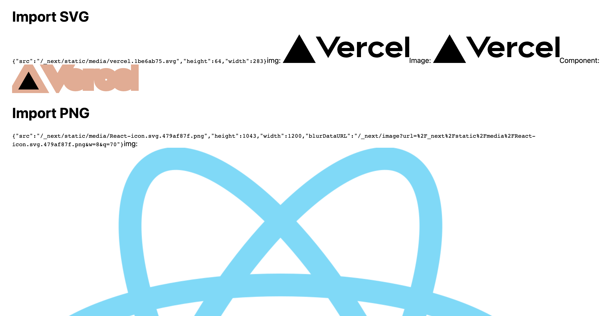

最終程式碼可以[在此](https://github.com/jason71708/nextjs-svg-component-setting)觀看。
