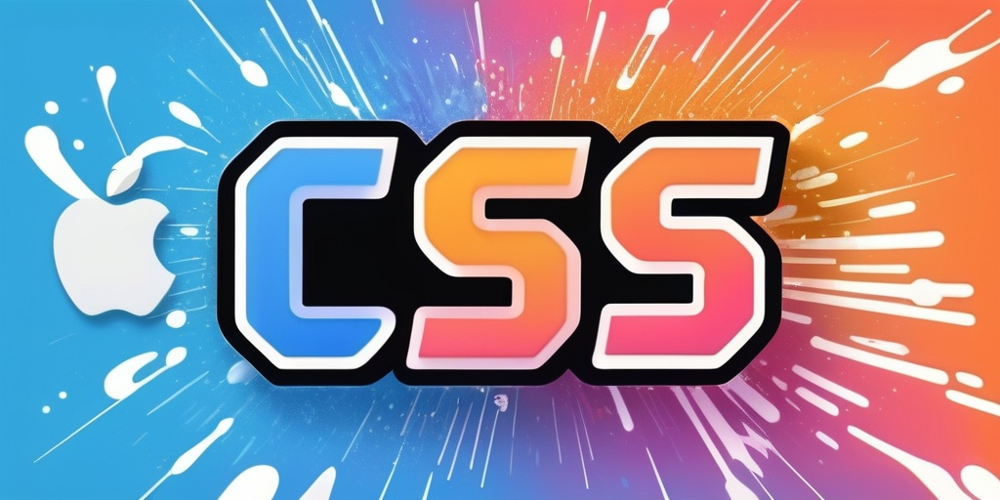
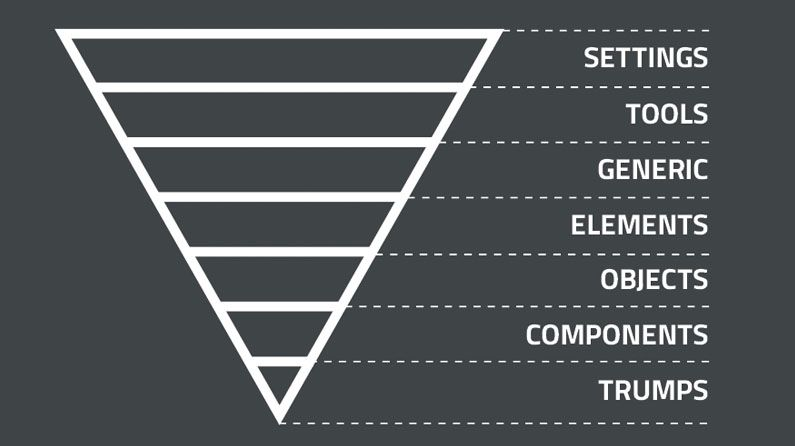
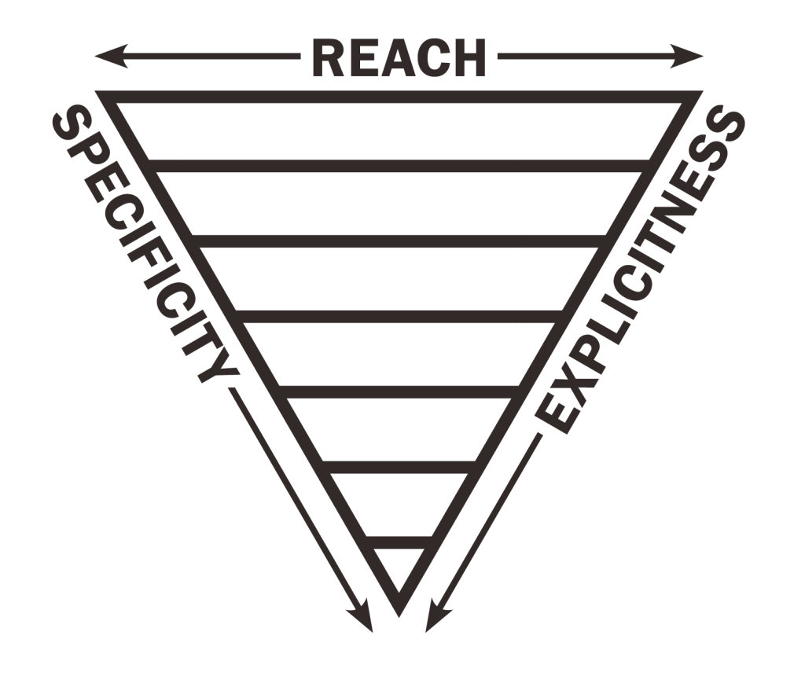

CSS 也寫了一段時日，想整理下現今常見的一些 CSS 設計模式，包括 BEM、OOCSS、ITCSS 到 SMACSS 等規範。同時也想分享下對於近幾年興起的 Tailwind CSS 中 Atomic CSS 概念的看法，了解下各種設計模式的差異和優缺點。

<!--truncate-->

## 命名方式

首先不管是哪種設計模式，CSS 的命名方式大多分為三類：camelCase、underscores、hyphen

### camelCase

小駝峰命名

```css
.primaryBtn {
  background: blue;
}
.cancelBtn {
  background: gray;
}
.userList {
  display: flex;
  flex-direction: column;
}
```

算是我個人不太喜歡的命名方式，主要是樣式名稱很容易跟 JS 變數命名衝突，在需要全域搜尋修改時就需要留意改動的地方。

但優點是選取很方便，點兩下就能選取完整名稱。

### Underscores

下劃線命名，有的會用雙下劃線。

```css
.primary_btn {
  background: blue;
}
.cancel_btn {
  background: gray;
}
.user_list {
  display: flex;
  flex-direction: column;
}
```

也是選取很方便，點兩下就能選取完整名稱。

### Hyphen

連字符命名，最常見的命名方式。

現今大多數的 CSS 框架都使用連字符命名。

```css
.list-wrapper {
  display: flex;
}
.list-content {
  background: white;
}
.list-item {
  background: blue;
}
```

與 camelCase 剛好相反，不容易和 JS 或其他變數衝突，但沒辦法點兩下選取完整名稱。

## 命名規範

上述只有介紹命名方式，但網頁元素這麼多樣，各種狀態、層級混雜在一起需要更明確的規則去命名。所以就有了以下四種命名規範：OOCSS、SMACSS、BEM、ITCSS

### OOCSS

全名為 "Object Oriented CSS"，有兩個原則：分離結構與樣式、分離容器與內容。

分離容器與內容意思是將各個元素層級對應的樣式分別命名，避免出現像下面的依賴關係：

```css
/* 依賴關係 */
.card {
  display: flex;
}
.card .title {
  font-size: 32px;
}
.card .button {
  background: blue;
}
/* OOCSS */
.card {
  display: flex;
}
.title {
  font-size: 32px;
}
.button {
  background: blue;
}
```

分離後，`.title` 與 `.button` 就能被使用在不同的容器中，不會被侷限於使用在 `.card` 內。

而分離結構與樣式意思是將該元素會有的各種狀態對應的樣式分別命名，包含預設的樣式，與其衍伸的樣式，這樣將來要新增各種狀態時只要更動衍伸樣式即可，預設樣式依然不變。

```css
.button {
  color: black;
  background: white;
  width: 100px;
  height: 32px;
  border-radius: 4px;
}
.button-primary {
  background: blue;
}
.button-success {
  background: green;
}
.button-disabled {
  background: gray;
}
```

當按鈕要切換狀態時，只要添加或移除衍伸的樣式即可，基本的樣式不會更動到。

此規範優點是能將 CSS 樣式組件化，狀態工具化，元素的樣式能獨立使用不被其他容器影響，狀態樣式也能隨時更換，不影響元素本身預設的樣式。

大名鼎鼎的 [Bootstrap](https://getbootstrap.com/) 就是使用此命名規範，個人早期也受此影響最常用此規範。

### SMACSS

全名為 "Scalable and Modular Architecture for CSS"，主要核心概念分為五種結構：Base、Layout、Module、State、Theme。

- Base：元素本身的預設樣式，概念同 CSS Reset 幫助訂定基礎的樣式，例如 h1、h2 等。
- Layout：畫面的區塊樣式，會用 ID 命名，若是有衍伸樣式會用 l 當作前綴取名，例如 `#header`、`#body`、`#footer`、`l-fixed` 等。
- Module：組件樣式，和 OOCSS 概念雷同，例如 `.button`、`.card` 等。
- State：狀態樣式，常用 is 作為前綴取名，例如 `is-hover`、`is-disabled` 等。
- Theme：主題樣式，若是有分白天黑夜甚至是節慶主題的顏色，就會用到此結構，官方範例是在 `theme.css` 會寫一個一樣的樣式名稱但屬性不一樣。

```css
/* Base */
h1 {
  font-size: 32px;
}
/* Layout */
#header {
  position: relative;
}
.l-fixed #header {
  position: fixed;
  top: 0;
}
/* Module */
.button {
  background: white;
}
.button-primary {
  background: blue;
}
/* State */
.is-disabled {
  background: gray;
}
/* Theme */
/* 原本樣式 */
.button {
  background: white;
}
/* 在 theme.css */
.button {
  background: pink;
}
```

此規範個人來說不太喜歡，雖然也有 OOCSS 的優點，但更明顯的缺點是使用了更高優先度的 id 選擇器，而區塊和元件的區分模糊會讓誰要用 `#` 或 `.` 的問題變得嚴重。區塊有延伸樣式時還要需用到 `l-fixed` 的寫法，和 `#header` 一起使用，混用 CSS 選擇器會有個隱憂是樣式優先度會需要更加留意。

但個人蠻喜歡 Base 的概念，自己很多專案都會用 CSS Reset 先把瀏覽器醜醜的預設樣式改掉。

### BEM

全名為 "Block Element Modifier"，是 Yandex 公司推出的一種 CSS 命名規範。

主要遵循 `block__element--modifier` 的規則為樣式命名。

以區塊（Block）、元素（Element）和修飾子（Modifier）舉例如下：

```css
.list__item__button {
  background: white;
}
.list__item__button--active {
  background: blue;
}
.list__item__button--disabled {
  background: gray;
}
```

能很好的區分樣式層級，可讀性高，並且 `modifier` 的設計也能易於理解使用情境，算是汲取了上面兩個規範的優點但是簡化成易於遵循的規則。

更詳細的說明可參照[官方文件](https://getbem.com/)。

### ITCSS

全名為（Inverted Triangle Cascading Style Sheets），為上述幾種規範中使用率最低的一個，但只是因為早期提出這個規範的作者 [Harry Roberts](https://twitter.com/csswizardry) 沒有建立介紹的官網與文檔，所以才導致很少人認識。現在雖然有建立[官網](https://itcss.io)，但也只有標題跟幾行介紹而已。

ITCSS 的概念主要分為七層倒三角的結構，如下圖：

越上層其定義的樣式越通用，越下層其定義的樣式越具有特定用途，而下層可以影響上層樣式。

- Setting：定義主題色、字體、間距數值等等，通常用於 CSS 變數
- Tools：有寫過 SCSS 或 LESS 的應該對 mixin 的概念不陌生，需結合 CSS 預處理器撰寫。
- Generic：等於 CSS Reset 的概念。
- Elements：定義網站各個元素的基礎樣式，如 `h1`、`h2`、`h3` 等等。
- Objects：定義骨幹樣式，不允許出現外觀樣式，簡單說就是可以設定間距、排版屬性但不能設定顏色或字體，類似 [OOCSS](#oocss) 的結構概念或是 [SMACSS](#smacss) 的 Layout。
- Components：UI 組件樣式相關，如 `card`、`button` 等等。
- Trumps：唯一可以寫 `!important` 的層級，這層用於特殊狀況處理。

而 ITCSS 也提供了 3 種指標來作為命名規範的總結：


- Reach：從剛開始定義的主題色、字體字級到越後面根據單一元件的樣式撰寫，越後面的樣式使用的範圍越窄，也就越難被 "reach" 到，而最後前面的主題色定義非常容易 "reach" 到，改個某個顏色，幾乎全部地方都會影響到了。
- Explicitness：從剛開始定義的 CSS 變數與CSS Reset 到後面具體的元件樣式，從通用到具體。
- Specificity：類似的概念，越往下層，其使用的情境就越特定，像 `button` 就一定只會用在具有點擊互動的元素上。

雖然分了七層，但有些層的內容還是會過於龐大，例如 Objects 或 Components，作者認為如果結合 [BEM](#bem) ，那樣式的命名可以更有明確意義，也就是 "BEMIT"。

而作者認為 ITCSS 的層數不必完全遵守，可以保持靈活性，例如在小型的專案上也不用分那麼多層，在大型專案上可以再多分一層，只要遵守 3 種指標來排序分層即可。

### Atomic CSS

這邊直接引用 [css-tricks](https://css-tricks.com/lets-define-exactly-atomic-css/) 寫的定義：
> Atomic CSS is the approach to CSS architecture that favors small, single-purpose classes with names based on visual function.

Tailwind CSS 就是實作了 Atomic CSS 這個概念的一個 CSS 框架，而我也是因為 Tailwind CSS 才認識了 Atomic CSS 的概念，而且是一認識就馬上愛上。

簡言之 Atomic CSS 就是盡可能的在每個樣式中定義最小最少且單純的樣式：
```css
.padding-left-16 {
  padding-left: 16px;
}
.color-red {
  color: red;
}
```
而樣式名稱也對應至其定義的屬性。

阿這個跟我直接寫 `style` 在 `html` 上有什麼差別？

差得可多了，其中最大的優點是可以寫偽元素和 `:nth-child` 之類的樣式，這是寫 `style` 辦不到的。
而且 `style` 樣式優先級很大，很難覆蓋。

它最大的優點也是我最喜歡的點是，各個樣式獨立，不會互相影響，有維護過大型專案的的 CSS 經驗就知道，很常遇到各種樣式命名百花齊放的情況，而且通常要修改某個地方樣式時也可能因為其他地方也用到同樣樣式，而另邊畫面跑版。

那這樣每次寫相同的樣式都要像這樣 `<button class="padding-left-16 color-red">` 寫一大串嗎？

首先 Atomic CSS 的優點是可以自由組合出想要的樣式出來，而這種組合如果很常很常用到，而且剛好專案的 JS 是用 Vue 或 React 時，這時應該把這段拆出來做成一個獨立元件，例如 `<PrimaryButton />`。

而且 Atomic CSS 在大型專案上還有個優點是可以有效減少 CSS 檔案大小，甚至是效能。因為它是以樣式屬性為單位，今天有一百個不同頁面，但用到的樣式屬性都差不多，就頂多是寫 HTML 時寫出符合頁面的一百種組合而已。但如果是傳統根據當前情境命名的話有可能會有 `news-content` 、 `article-content` 、 `product-content` 等等各種相似樣式屬性但不同情境的命名，隨著專案規模變大，CSS 檔案也會隨之增加。

而效能的部分，相信大家都看過類似的巢狀樣式：

```scss
.menu {
  display: flex;

  .menu-item {
    flex: 1;
    margin-bottom: 10px;

    .memu-image {
      width: 60%;
    }
  }

  .memu-item:last-child {
    margin-bottom: 0;
  }
}
```

甚至還有使用 `#` ID 選擇器的，這類巢狀樣式會讓瀏覽器在渲染頁面時需要比對的樣式變多，這個 `.menu` 底下有 `.menu-item` 而底下有 `.memu-image` 才把屬性 `width: 60%` 套用上去。HTML 整體是一個樹狀結構，這樣的巢狀樣式一堆，層層配對下去的量一大也會影響到渲染效能，而 Atomic CSS 沒有這問題，有 `.color-red` 就直接套用上去，沒有前後樣式相依的問題。

### 該使用什麼命名規範

個人經驗是看目前負責的專案是用什麼就繼續沿用，每個人都自己一套 CSS 命名規範只會讓當前的樣式變得更加繁雜難以維護，若是新的專案則可以和同事討論共同決定。

而這些命名規範的推出是為了讓 CSS 的撰寫更加清晰且維護更加容易，若只是小型專案，單純使用 hyphen 的命名方式何嘗不能呢。

CSS 最大的問題在於樣式是全域性而且具有優先級判定，所以出現了 CSS-in-JS 或 CSS modules 等方案，將各個 CSS 樣式 scope 化，但也有了 CSS 檔案隨迭代越來越肥，樣式名稱越來越繁雜的問題。

總結來說，上述規範與方案都是盡可能讓 CSS 可複用性、可維護性增加，減少改 A 壞 B 的情況。而我個人的 Side Project 是偏好使用 Atomic CSS 規範來撰寫樣式，但大都是直接用 Tailwind CSS 比較省事。
