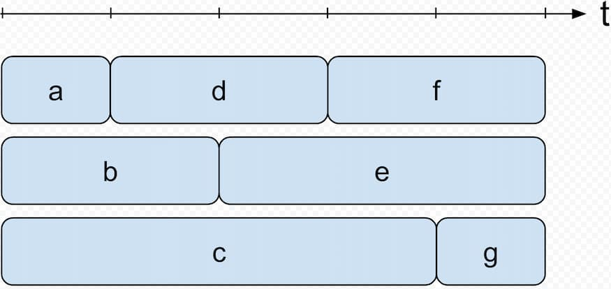

此篇文章收集些面試前端工程師時會遇到的高頻考題

<!--truncate-->

## 實作 debounce 函式

```js
const debounce = (fn, delay = 100) => {
  let timer = null;

  return (...args) => {
    clearTimeout(timer);
    timer = setTimeout(() => {
      fn(...args);
    }, delay);
  };
}
```

應用場景像是輸入 google 搜尋時打字停下後才會出現建議的搜尋關鍵字，減少前面還在打字輸入時就去打 API 取得搜尋關鍵字的消耗。

## 實作 throttle 函式

```js
const throttle = (fn, delay = 100) => {
  let timer = null;

  return (...args) => {
    if (timer) return;
    timer = setTimeout(() => {
      fn(...args);
      timer = null;
    }, delay);
  }
}
```

## 簡易實作 React.useState

```js
let states = [];
let setters = [];
let firstRun = true;

// React 使用指標去對應每個 useState 的東西，每次重新渲染時會將 cursor 重置為零，並依序回傳 state 與 setter
// 同理可套用到其他 React Hooks，這也是為何規定 hooks 需要定義在 functional component 的最頂端
let cursor = 0;

function createSetter(cursor) {
  return function setterWithCursor(newVal) {
    state[cursor] = newVal;
  };
}

export function useState(initVal) {
  if (firstRun) {
    state.push(initVal);
    setters.push(createSetter(cursor));
    firstRun = false;
  }

  const setter = setters[cursor];
  const value = state[cursor];
  cursor++;

  return [value, setter];
}
```

應用場景像是偵測網頁滾動這類會連續觸發多次的事件，用於減少函式的執行頻率。

## Promise.all with concurrency

實作一個類似 `Promise.all` 能保持資料順序並限制同時間最多 `concurrency` 個 `promise` 在執行

```js
function run( promiseFactories, concurrency )
{
    const result = [];
    let fullfills = 0;
    let next = 0;
    return new Promise( resolve =>
    {
        if ( promiseFactories.length > concurrency )
        {
            const recursiveHandler = ( index ) =>
            {
                promiseFactories[ index ]().then( r =>
                {
                    result[ index ] = r;
                    fullfills++;
                    if ( fullfills === promiseFactories.length )
                    {
                        resolve( result );
                    } else if ( next < promiseFactories.length )
                    {
                        recursiveHandler( next );
                        next++;
                    }
                } );
            };
            for ( next; next < concurrency; next++ )
            {
                recursiveHandler( next );
            }
        } else
        {
            promiseFactories.forEach( ( p, index ) =>
            {
                p().then( ( r ) =>
                {
                    result[ index ] = r;
                    fullfills++;
                    if ( fullfills === promiseFactories.length )
                    {
                        resolve( result );
                    }
                } );
            } );
        }
    } );
}

function delay( data, delay )
{
    return () => new Promise( resolve => setTimeout( () =>
    {
        console.log( 'resolves', data ); // Debug
        resolve( data );
    }, delay * 1000 ) );
}

run( [
    delay( 'a', 1 ),
    delay( 'b', 2 ),
    delay( 'c', 4 ),
    delay( 'd', 2 ),
    delay( 'e', 3 ),
    delay( 'f', 2 ),
    delay( 'g', 1 )
], 3 ).then( console.log );
```

看下圖比較好理解：


執行時 log 順序應該為：

```
resolves a
resolves b
resolves d
resolves c
...
```

最終 output 應該回傳：`[  'a', 'b', 'c', 'd', 'e', 'f', 'g']`

> 本文會隨時間而不斷增加更新

<!-- 1. [Map vs Object](https://www.frontendinterviewhandbook.com/blog/javascript-object-vs-map): 此篇先舉出 `Object` 使用上的隱憂與缺點再介紹 `Map` 的出現，並撰寫了一些測試比較兩者在各種情況下的效能。 -->