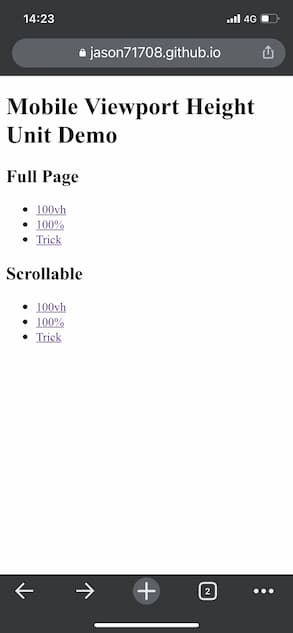

> 上圖為 Google I/O 2022 所演示的新長度單位，但目前在各大瀏覽器支援度不佳。

手機網頁與電腦網頁的 Viewport 在計算上有差異，會發生畫面預期不一致的情形，此篇文章將簡單講解問題與解決方案。

<!--truncate-->

這邊有 [Demo](https://jason71708.github.io/mobile-height-unit-demo/) 方便觀看各個單位尺寸的差異。



## `100vh`

在 Full Page 這邊觀看會發現 `100vh` 的高所涵蓋範圍會包括底下按鈕列表覆蓋的區域，這如果在一些有滿版需求的網頁上會將部分內容擋住造成瀏覽體驗不佳


到 Scrollable 觀看 `100vh` 能更清楚看到下滑後瀏覽器按鈕列表與上方網址列縮進。

## `100%`

先說結論， `100%` 就是看父層元素多少就是多少，若父層元素沒有特別設高度，就是看其內容有多少，高就多少。

像 Demo 中塞了很多假字，在上下兩個 `100%` 的範例中，因為藍色區塊的父元素沒有特別設高度，所以其內容多高，實際上就是多高，沒有差異。

換句話說若內容明明撐不到超過手機網頁的可視範圍高度，卻設定高 `100%` 的話，藍色區塊只會包含到內容而已，會看到底下一塊留白。

## 解決方式

在 Full Page 的 `trick` 示例中可以看到藍色區塊是正確滿版呈現。


先上程式碼：

```js
  // js
  let vh = window.innerHeight * 0.01;
  document.documentElement.style.setProperty('--vh', `${vh}px`);

  window.addEventListener('resize', () => {
    let vh = window.innerHeight * 0.01;
    document.documentElement.style.setProperty('--vh', `${vh}px`);
  });
```

```css
  /* css */
  .box {
    height: calc(var(--vh, 1vh) * 100);
  }
```

主要是透過抓取 `window.innerHeight` 計算正確的可視範圍，並將其設為 CSS variable 。

`var()` 中第二個參數為預設值，若第一個參數尚未定義的話將會先使用預設值。

網頁有可能因為手機水平方向不同而改變畫面長寬，此時需要監聽 `resize` 事件做動態調整。


## 注意事項

要用上面提到的方式做滿版網頁要確定網頁本身是不滑動的，就算要滑動得要在該滿版元素內做滑動才行。

具體可看 Scrollable 的 `trick` ，可以看到下滑時因底部按鈕列縮進，導致藍色區塊會動態變長。

再者動態變動元素的長寬等數值會讓整個該元素重新計算並渲染，尤其是像範例中藍色區塊這樣大的元素裡面若包了很多內容、特效等等的話，重新渲染版面的代價可能會很大。

這也是手機瀏覽器開發者有意將手機版網頁的可視區域與 CSS viewport 不做相依的原因，若 `vh` 會隨著上下滑動而更新，版面因重新渲染會一直變動，除了耗效能外，觀看體驗也會很差。

## 參考來源

- https://stackoverflow.com/questions/37112218/css3-100vh-not-constant-in-mobile-browser