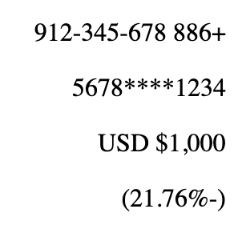
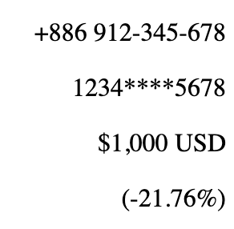

RTL（Right-to-Left）排版是一種文字和內容從右至左排列的排版方式，通常應用於使用從右到左書寫的語言，如阿拉伯語、希伯來語、波斯語和烏爾都語等。此篇文章主要是紀錄與分享筆者工作時實作此需求時的眉角。
也因為有了 RTL 開發經驗，現在撰寫 CSS 或 HTML 時都會留意一下 LTR 與 RTL 的呈現。

<!--truncate-->

## HTML 調整

```html
<html dir="rtl" lang="fa-IR">
```

在 `html` 標籤上配置 dir (direction) 屬性使其預設佈局變更至從右往左，這也是一切調整的起始點。

其中 `fa-IR` 為波斯語代碼。

## CSS 調整

所有具有方向性的 CSS 屬性都要做改寫：

```
margin-left -> margin-inline-start
margin-right -> margin-inline-end
padding-left -> padding-inline-start
padding-right -> padding-inline-end
text-align: left ->  text-align: start
text-align: right -> text-align: end
justify-content: left -> justify-content: start
justify-content: right -> justify-content: end
border-left -> border-inline-start
border-right -> border-inline-end
left: 10px -> inset-inline-start: 10px
right: 10px -> inset-inline-end: 10px
```

其中 `border-radius: 16px 0 0 16px` 需要改寫成：

```
border-start-start-radius: 16px;
border-start-end-radius: 0;
border-end-start-radius: 0;
border-end-end-radius: 16px;
```

以上改寫後就能自動根據 `dir` 的屬性變更排版方向，但由於瀏覽器對於 RTL 的支援在近幾年才開始普及，以上屬性有些還是需要看下瀏覽器支援度與本身專案的瀏覽器支援需求。

那如果需要針對 RTL 情境做特別調整的話能用以下方式：

```scss
.rtl-icon {
  transform: scaleX(1);
}

html[dir="rtl"] {
  .rtl-icon {
    transform: scaleX(-1);
  }
}
```
或是在 JavaScript 中宣告 `isRTL` 變數供全域使用。

## 符號與數字


> 調整前

帶符號的數字都需要保持原來左到右的方向，但因為 `html` 配置了 `rtl` 屬性會讓符號與數值翻轉，所以我們需要把他們調整回來，例如：
- +886 912-345-678
- 1234****5678
- $1,000 USD
- (-21.76%)

```html
<p>
  <span dir="ltr">$1,000 USD</span>
</p>
```


> 調整後

在外層多包個 `span` 標籤配置 `dir` 屬性使其翻轉回來，也不會影響 `p` 標籤本身從右到左的排版佈局。

另種方式是在要翻轉的符號前面加上 `&lrm;`

```html
<p>(&lrm;-21.76%)</p>
```

這樣負號就不會跑到右邊去了。

## 日期與時間格式

英文：2022-12-31 23:59:59 -> 波斯語：23:59:59 2022-12-31

日期與時間順序對調，但日期與時間本身的方向不變。

### Moment.js

而常用的 Moment.js 也提供了配置方法：

```js
import 'moment/locale/ar-kw'; // 阿拉伯語

moment.locale('ar-AE');
```

## 結語

雖然配置本身不難，檢查與調整畫面卻是需要花最多心力的地方，也需要和 UI 設計師大量溝通。
下次撰寫樣式時不妨可以用 `start` 、 `end` 替代原本的寫法，在未來若是要支援 RTL 時也會更加快速。