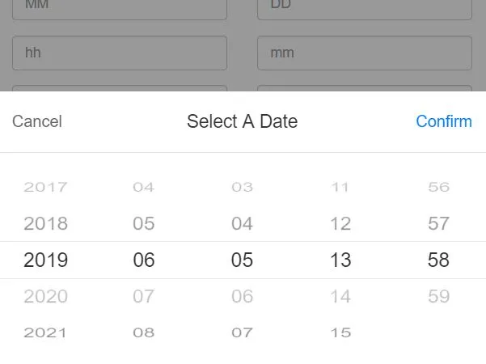
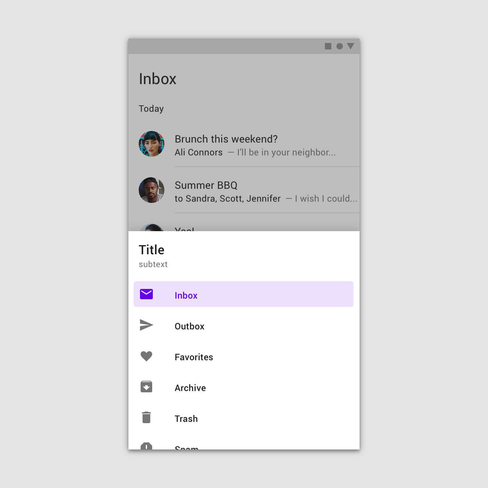

本文主要紀錄些曾遇到過的一些網頁在 App WebView 裡的兼容問題，以及解決方式。

<!--truncate-->

## IOS 日期標準格式

```js
new Date('2024-11-21')
```

我們常用的日期格式字串大概會長這樣 `'2024-11-21'`，在電腦瀏覽器與 Android 系統的手機中都可以正確解析成 `Date` 物件，但是在 IOS 系統版本低於 16 的環境會出現 `'Invalid Date'` 的錯誤。

解法是把字串改成用 `'/'` 分隔，例如 `'2024/11/21'`。

```js
new Date('2024-11-21'.replaceAll('/', '-'))
```

那踩到這坑的起因是有用到像輪盤的選日期用的組件：



選完日期後會將每個輪盤選中的數字組成日期字串再用 `new Date()` 建立日期物件。

實測若用 `day.js` 去處理是可以避免這種日期解析的兼容問題，但是 `moment.js` 依然會報錯。

對於日期物件的建立建議還是用 Timestamp 處理，若是像遇到上面組件那樣的場景時，可以先用 `timestamp = 0` 建立一個日期物件。然後再用 `setMonth`、`setFullYear` 等方法來將年月日一個個寫入 (記得月份是從 0 開始，而且要注意時區問題)。

## 網頁下拉滑動會連動 WebView 下拉刷新

在 WebView 中，若是網頁滑動到最上面，再繼續下拉時會觸發 WebView 刷新。這個行為本身沒什麼問題，手機瀏覽器上也是這樣。

問題的起因是網頁中有用到 Drawer 組件，內部可以滑動的類似如下：



Drawer 開啟時，會禁止網頁本身滑動：

```js
document.body.style.overflow = 'hidden'
```

然後還有個舊有邏輯是打開 Drawer 時是網頁會自動滑動置頂。

```js
window.scrollTo({ top: 0, behavior: 'smooth' })
```

這時因為網頁置頂了，所以繼續下拉會觸發 WebView 的下拉刷新邏輯，但是這時 Drawer 本身內部又可以滑動，就變成 Drawer 滑動到底下要再滑動到上面時就會沒辦法順利滑動，會一直連動到 WebView 的下拉刷新使其變成整個 WebView 下拉。

這問題在手機瀏覽器上測試是不會發生的，但是專案場景是 APP 會打開我們的網頁，所以最終是將自動置頂的邏輯給刪除，其實也可以留一點空間例如 `top: 1` 來避免此問題。

## 結語

網頁可以顯示在各種裝置上，電腦、平板、手機甚至是電視。每個裝置環境不同，相對的兼容性問題也會增多，很多都是踩坑才會發現的，日後有遇到其他問題也會更新在此篇文章中。