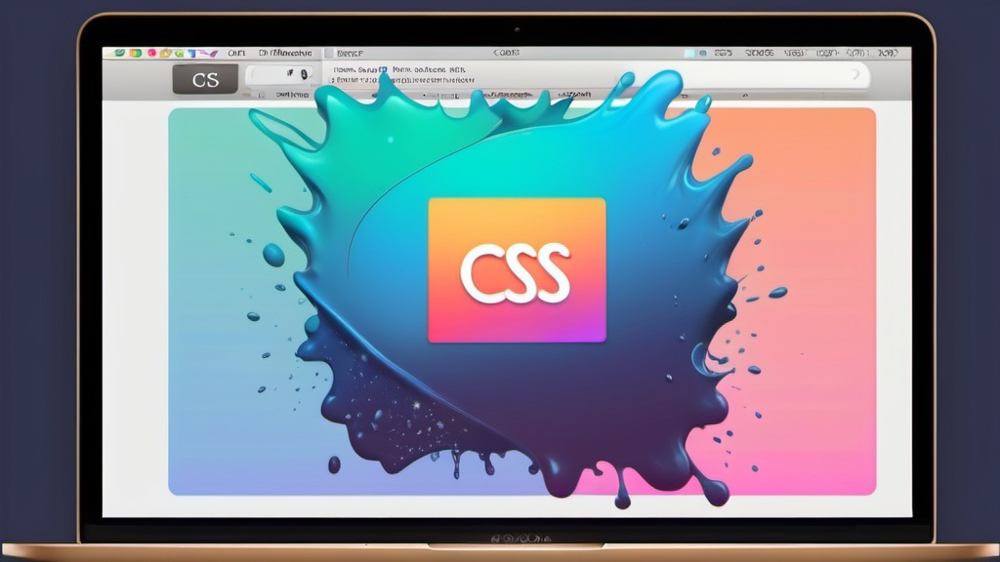

本文分享幾個 CSS 維護技巧：減少巢狀結構與依賴、避免過度使用 inherit、建立設計指引、善用 Mixins 和 Util class，以及專注使用單一 CSS 選擇器。透過這些方法，讓樣式更具可讀性與可維護性。

<!--truncate-->

在閱讀本篇文章前推薦先認識看下之前整理過的 [CSS 命名規範與設計模式](/blog/2022/06/23/css-design-patterns)。

## 盡可能減少巢狀結構與依賴關係

有用過 SCSS 或 Less 等等的 CSS 預處理器一定很常看過以下結構：

```scss
.card-wrapper {
  ...

  .card-image {
    ...
  }

  .card-content {
    ...
    .card-title {
      ...
    }
  }
}
.card-group.card-wrapper {
  ...
  .card-image.card-image-gallery {
    ...
  }
}
```

如上述代碼，外層樣式如果沒有 `.card-wrapper`，那麼這些內層樣式都不會套用，這就一定程度上依賴了外部樣式。HTML 和 CSS 樣式和層級都要遵守上述的巢狀規則才能生效，但在開發迭代頻繁，組件的設計與狀態
可能也會增多或修改，這時如果需要更改 HTML 本身的結構，例如可能某些元素外層需要包個 `<div>` 或 `card-title` 需要移到外層跟 `card-content` 同層級，以符合新的設計樣式。這些巢狀依賴可能會讓組件的修改與維護增加許多困難。

還有一個問題點是，撰寫響應式樣式時，要需要照著原本的巢狀結構，否則就可能會因為 CSS 樣式優先級較低而無法套用，甚至還有看過直接用 `!important` 來修正的情況。

```scss
@media (min-width: 768px) {
  .card-wrapper {
    ...
    .card-content {
      ...
    }
    .card-title {
      // 這裡跟原本巢狀結構不一樣了，造成這裡的樣式優先級較低，無法在該螢幕尺寸下套用

      color: blue !important; // 甚至有人會用這種方式修正
    }
  }
}
```

個人偏好的解決方式是，將這些樣式盡可能的打平，移除每個樣式間的依賴關係盡量獨立。

```scss
.card-wrapper {}
.card-content {}
.card-image {}
.card-title {}
```

那麼組件的狀態怎麼辦？ 個人常用 [BEM](/blog/2022/06/23/css-design-patterns/#bem) 規範 的修飾子（Modifier）來做命名。

```scss
.card-wrapper {}
.card-wrapper--disabled {}
.card-image {}
.card-image--disabled {}
```

若是 `:hover` 、 `:nth-child` 、 `::before` 等等的偽類選擇器或偽元素，因為這些都是作用於這個樣式本身，所以可以允許巢狀的寫法，因為它不會造成與其他樣式的依賴。

```scss
.card-image {
  ...
  &:hover {
    ...
  }

  &:nth-child(even) {
    ...
  }
}
```

但一定有遇過情境是 hover 到卡片上時，卡片裡的圖片就要做漸變效果之類的，這樣無法避免的依賴關係，我習慣會"獨立"寫在當前 CSS 檔案的最後面，響應式樣式的前面：

```scss
// 前面一堆 CSS
.card-wrapper {}
...
.card-wrapper:hover {
  .card-image {
    ...
  }
}
// 後面開始響應式樣式
@media (min-width: 768px) {
  ...
}
```

上述情境若在響應式有其他設計時，一樣寫在該區塊的最後面。

寫在最後面的原因是避免 CSS 因為前後順序而造成無法成功套用，而且組件拆分獨立的好的話，這類的情境在單一組件內不會太多，可以當作特殊狀況這樣處理。

至於為何我會強調"獨立"，主要是日後要做刪改時比較好聚焦修改的地方，把獨立出來寫的樣式刪掉也不會對原本的樣式產生影響。

還有一個蠻大的坑如下：

```scss
.card {
  &-wrapper {
    ...
  }

  &-content {
    ...
  }
}
```

千萬不要這樣撰寫，雖然可以少打幾個字，但日後要搜尋對應完整的樣式名稱會非常困難。

總結以下幾點：

1. 提升獨立性，不受其他樣式依賴影響，避免改 A 壞 B。
2. 功能聚焦，各種狀態可用修飾子命名來區分，日後要新增或修改的地方都一目瞭然。
3. 在設計需求下，可一定程度的容許巢狀結構，但要獨立出來撰寫。
4. 作用於樣式本身的偽類選擇器與偽元素可允許巢狀寫法。
5. 樣式名稱需撰寫完整。

## 別再依賴 inherit

最常見的使用情境是在外層容器定義 `color: white`，內層所有的元素不用加樣式就能都是 `color: white`。

但這機制依然會違反上段講到的"提升獨立性，不受其他樣式依賴影響"的原則，較好的方式是在每個需要顯示文字的地方都定義好 `color`，雖然要寫的地方會變多，但是日後要修改某個元素樣式或是需更動外層容器時較能容易修改且不影響原本樣式。

唯一可允許 inherit 的地方是在 `html` 或是 `body` 上定義好預設的樣式，這兩個元素是不會變動層級的。

## 建立 Design Guideline

我認為每個產品都需要有 Design Guideline，除了可以達到視覺效果統一，也能提升開發與維護效率。
雖然這是比較偏設計師在做的，但若是產品規模較小沒有設計師，也可以做些初步的定義，例如 `--text-primary: color: black;`、`--bg-primary: color: white;`、`--text-sm: font-size: 12px;` 等等，而 CSS variable 在目前的瀏覽器支援度已經很高（IE 除外），可以放心使用。

定義了基本的 CSS variables 之後，就能方便複用這些樣式：

```scss
.card-title {
  color: var(--text-primary);
  font-size: var(--text-sm);
}
```

要支援明亮模式或是暗黑模式甚至是節慶主題，也只需要替換 `--text-primary` 這類與顏色相關的變數即可，之前撰寫好的樣式都不用更改。

## Mixins & Util class

上段建立了一些 CSS variables 之後，我們就能來定義通用的 Mixin 或是 Util class：

```scss
// scss 的 mixin 功能
@mixin body-text {
  color: var(--text-primary);
  font-size: var(--text-sm);
  font-weight: 400;
  line-height: var(--leading-normal);
}
// 引用時記得引入 mixin 檔案
.card-content {
  @include body-text;
  padding: var(--padding-sm);
}
```

而有些樣式比較特別可以拆出來的例如 ellipsis 的省略文字效果，或是滾動條的自定義顏色與樣式則可以做成 Util class：

```scss
.text-ellipsis {
  overflow: hidden;
  text-overflow: ellipsis;
  white-space: nowrap;
}

.custom-scroll-bar {
  &::-webkit-scrollbar {
    width: 20px;
  }
  &::-webkit-scrollbar-track {
    box-shadow: inset 0 0 5px grey;
    border-radius: 10px;
  }
  &::-webkit-scrollbar-thumb {
    background: red;
    border-radius: 10px;
  }
}
```

```html
<div class="custom-scroll-bar">
  <p class="text-ellipsis">This is a long text</p>
<div>
```

盡可能的重複利用與拆分最小功能樣式，以 ellipsis 來說這三個樣式要一起設定才能達到省略文字效果，滾動條同理。

## 使用單一種 CSS 選擇器

原因前面有稍微提過，因為 CSS 有樣式優先級，最大到最小依序是 `!important`、id、class、tag、`*`，若是混用的話最終會造成樣式套用與預期不一致。

```html
<div class="card card-primary">
  <p class="card-description">Hello</p>
</div>
```

```scss
.card {
  .card-description {
    color: white;
  }
}
.card-primary {
  p {
    color: black;
  }
}
```

以上範例程式碼最終的 'Hello' 會是白色，儘管黑色定義在比較後面，仍會因為 class 和 tag 的級別不同優先套用 `.card-description`。

可以的話盡可能全都使用 class 撰寫樣式，但唯一可以例外的地方是在 CSS Reset 時需要將瀏覽器預設元素的樣式給初始化，這時 tag 與 `*` 就可以使用。

## 結語

這篇文算是做前端開發以來的心得，個人一開始是接案型的公司工作，這時大多都是專案開發好交出去後就不太會再做太大的修改，但後來比較想專注在開發與維護產品上，所以待過各種開發自家產品的公司，很多產品都是 3-5 年的年齡，經過產品迭代而且大多數人都不太會注意 CSS 的維護，反而成為日後要更改或翻新介面時最大的難關。

個人在處理這些不堪複用的 CSS 樣式時可是痛過了好幾次，所以在這篇文章中分享一些常出現的地雷與心得，希望能幫助減少管理 CSS 的時間，能有更多時間能專注在產品本身的業務邏輯開發與網頁效能這些更有價值的地方上。
