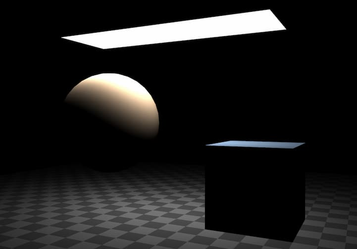

> 此筆記對應[官方文件 Lights 章節](https://threejs.org/manual/#en/lights)。

在開始之前我們先在 Three 環境內加上 `OrbitControls` 讓我們能用滑鼠拖曳調整相機視角。

```js
import {OrbitControls} from '/examples/jsm/controls/OrbitControls.js';
controls.target.set(0, 5, 0);
controls.update();
```

`OrbitControls` 有個 `target` 中心點，當我們拖拉調整視角時，都是圍繞在這個中心點。

另外有相關屬性變更時也要呼叫 `controls.update()` 讓更新生效。

其餘部分可依照官方文件所述建置一個方便我們觀察各種 Lights 的環境。

## AmbientLight

```js
const color = 0xFFFFFF;
const intensity = 1;
const light = new THREE.AmbientLight(color, intensity);
scene.add(light);
```

最不像真實光的光 XD，`intensity` 是設置光的強度，把 `AmbientLight` 加進場景後，此光會平等的照亮所有地方，故物件也沒有陰影相關的顏色變化。

## HemisphereLight

```js
const skyColor = 0xA1EE11;
const groundColor = 0xB1A1FF;
const intensity = 1;
const light = new THREE.HemisphereLight(skyColor, groundColor, intensity);
scene.add(light);
```

相比 `AmbientLight`，`HemisphereLight` 多了設置天地色，會將物件的顏色在天地色之間做倍增 (multiplies)。

物件朝上的面會被 `skyColor` 影響較多，反之朝下的面會被 `groundColor` 影響較多。

## DirectionalLight

此光源經常拿來模擬太陽光，會從光的位置朝 `target` 射出無窮距離的光線。

```js
const color = 0xFFFFFF;
const intensity = 1;
const light = new THREE.DirectionalLight(color, intensity);
light.position.set(0, 10, 0);
light.target.position.set(-5, 0, 0);
scene.add(light);
scene.add(light.target);
```

此光源多了 `target` 屬性，代表光源會朝向 `target` 的位置照射。

## LightHelper

像 `DirectionalLight` 這種光在場景中沒辦法直接看到實體位置，故我們可以引入 `DirectionalLightHelper` 幫助我們可看到光源的輔助線

```js
const helper = new THREE.DirectionalLightHelper(light);
scene.add(helper);
```

另外要提到的是，若是像官方文件這樣需要動態變動 LightHelper 的位置的狀況時，記得要呼叫 `helper.update()` 讓更新生效。

## PointLight

一種點光源，會從該點向四面八方射出光線，所以沒有 `target`。

```js
const color = 0xFFFFFF;
const intensity = 1;
const light = new THREE.PointLight(color, intensity);
light.position.set(0, 10, 0);
scene.add(light);

const helper = new THREE.PointLightHelper(light);
scene.add(helper);
```

而 `PointLight` 有個 `distance` 屬性，預設是 0，代表光源影響的極限距離為無窮遠，而大於 0 時代表光源影響至該距離為止，不管距離為何，離光源越遠，亮度皆會減弱。

## SpotLight

```js
const color = 0xFFFFFF;
const intensity = 1;
const light = new THREE.SpotLight(color, intensity);
scene.add(light);
scene.add(light.target);

const helper = new THREE.SpotLightHelper(light);
scene.add(helper);
```

聚光燈，照射範圍從光源位置呈現出圓錐狀，由於不是朝四面八方散射，所以需要 `target` 來決定要朝哪邊聚光。

實際上有兩個同心圓錐，外層和內層，外層至內層的範圍光線強度會從 `intensity` 遞減到 0。

其他屬性還有：

### `distance`

決定圓錐的高度，跟 `SpotLight` 的 `distance` 作用一樣，都是決定光最遠能照射的距離。

### `angle`

決定圓錐狀的散射角度

### `penumbra`

決定外內層的距離，0 代表內外層重疊，此時在光照範圍的邊緣會有很明顯的色差。

1 代表從圓錐中心點開始亮度衰減。

0.5 代表從圓錐中心點與外層圓錐邊緣的中心開始亮度衰減。

## RectAreaLight

`RectAreaLight` 只會在 `MeshStandardMaterial` 和 `MeshPhysicalMaterial` 上有效果。同時此光源有 `width`、`height` 屬性定義光源本身的長寬，效果很像辦公室或教室天花板的矩形平面燈。

官方文檔在這邊引入了 `RectAreaLightUniformsLib` 原因是 If you forget the data the light will still work but it will look funny so be sure to remember to include the extra data.

個人好奇會有多 funny 所以測試了一下，以下程式碼為沒有 `RectAreaLightUniformsLib` 的版本：

```js
import * as THREE from 'three'
import './style.css'
import { OrbitControls } from 'three/examples/jsm/controls/OrbitControls'
import {RectAreaLightUniformsLib} from 'three/examples/jsm/lights/RectAreaLightUniformsLib.js';
import {RectAreaLightHelper} from 'three/examples/jsm/helpers/RectAreaLightHelper.js';

const scene = new THREE.Scene();

{
  const planeSize = 40;
  const loader = new THREE.TextureLoader();
  const texture = loader.load('checker.png');
  texture.wrapS = THREE.RepeatWrapping;
  texture.wrapT = THREE.RepeatWrapping;
  texture.magFilter = THREE.NearestFilter;
  const repeats = planeSize / 2;
  texture.repeat.set(repeats, repeats);

  const planeGeo = new THREE.PlaneGeometry(planeSize, planeSize);
  const planeMat = new THREE.MeshStandardMaterial({
    map: texture,
    side: THREE.DoubleSide,
  });
  const mesh = new THREE.Mesh(planeGeo, planeMat);
  mesh.rotation.x = Math.PI * -.5;
  scene.add(mesh);
}

{
  const cubeSize = 4;
  const cubeGeo = new THREE.BoxGeometry(cubeSize, cubeSize, cubeSize);
  const cubeMat = new THREE.MeshStandardMaterial({color: '#8AC'});
  const mesh = new THREE.Mesh(cubeGeo, cubeMat);
  mesh.position.set(cubeSize + 1, cubeSize / 2, 0);
  scene.add(mesh);
}

{
  const sphereRadius = 3;
  const sphereWidthDivisions = 32;
  const sphereHeightDivisions = 16;
  const sphereGeo = new THREE.SphereGeometry(sphereRadius, sphereWidthDivisions, sphereHeightDivisions);
  const sphereMat = new THREE.MeshStandardMaterial({color: '#CA8'});
  const mesh = new THREE.Mesh(sphereGeo, sphereMat);
  mesh.position.set(-sphereRadius - 1, sphereRadius + 2, 0);
  scene.add(mesh);
}

{
  const color = 0xFFFFFF;
  const intensity = 5;
  const width = 12;
  const height = 4;
  const light = new THREE.RectAreaLight(color, intensity, width, height);
  light.position.set(0, 10, 0);
  light.rotation.x = THREE.MathUtils.degToRad(-90);
  scene.add(light);
  
  const helper = new RectAreaLightHelper(light);
  light.add(helper);
}

const canvas = document.querySelector('#c');
const renderer = new THREE.WebGLRenderer({canvas: canvas, antialias: true});
renderer.setPixelRatio(window.devicePixelRatio)

const camera = new THREE.PerspectiveCamera(40, canvas.offsetWidth / canvas.offsetHeight, 0.1, 100);
camera.position.set(0, 10, 20);

const controls = new OrbitControls(camera, canvas);
controls.target.set(0, 5, 0);
controls.update();

function resizeRendererToDisplaySize(renderer) {
  const canvas = renderer.domElement;
  const width = canvas.clientWidth;
  const height = canvas.clientHeight;
  const needResize = canvas.width !== width || canvas.height !== height;
  if (needResize) {
    renderer.setSize(width, height, false);
  }
  return needResize;
}

function render() {
  if (resizeRendererToDisplaySize(renderer)) {
    const canvas = renderer.domElement;
    camera.aspect = canvas.clientWidth / canvas.clientHeight;
    camera.updateProjectionMatrix();
  }

  renderer.render(scene, camera);

  requestAnimationFrame(render);
}
render();
```



實際看起來還好 XD，看不出有哪裡怪的地方。

接著我們也引入該 `RectAreaLightUniformsLib` 且執行 `init`：

```js
+ import {RectAreaLightUniformsLib} from '/examples/jsm/lights/RectAreaLightUniformsLib.js';
...
+ RectAreaLightUniformsLib.init();
```

加完這段後實際看也看不出哪裡有變化 XD。

`RectAreaLight` 沒有 `target`，取而代之的是 `rotation`，用來定義光線要朝哪個角度照。

## `physicallyCorrectLights`

`WebGLRenderer` 底下有個 `physicallyCorrectLights` 屬性，預設是 `false` 不會啟用，一旦啟用將會依照真實物理光計算光隨距離衰減的變化，只會影響 `PointLight` 和 `SpotLight`，`RectAreaLight` 則本身就是這樣計算了。

```js
+ renderer.physicallyCorrectLights = true;
```

而啟用此計算方式後，會有兩個屬性可設置來模擬真實物理光源：`power` 和 `decay`。

`power` 表示此光源的瓦數，像真實電燈泡那樣。
`decay` 表示隨距離減弱多少。

## Performance

要注意場景中的每個光源都會減慢 three.js 渲染場景的速度，因此應該在達成目標效果內盡量使用少量的光源。
