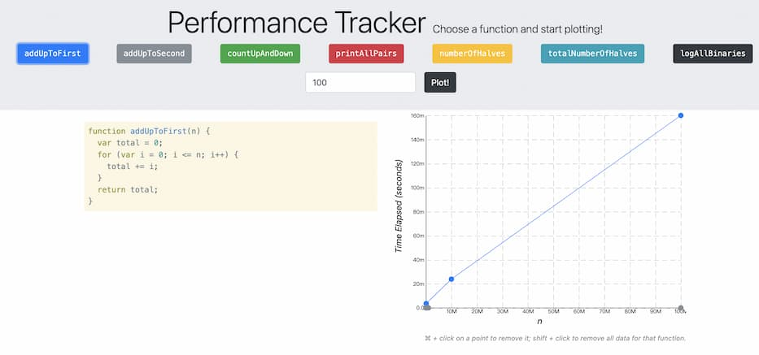
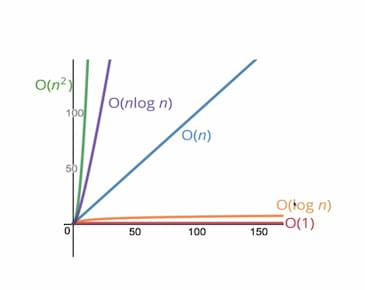

Big O Notation 是一種表示演算法複雜度的方式。同樣解決一個演算法問題，若該程式執行的時間越少，消耗的記憶體愈少，就是越好的解法。可以用來評斷該程式 (演算法) 的好壞。

當我們想要評估一個程式的複雜度時，我們通常都會假設輸入的資料量趨近無限大，考慮最邊際的情況。

```js
function addUpto(n) {
  let sum = 0;
  for (let i = 0; i <= n; i++) {
    sum += i;
  }
  return sum;
}
```
```js
function addUpto2(n) {
  return n * (n + 1) / 2;
}
```

我們看看上面兩個函式，一樣都是從 0 + 1 + 2 +..... 加到輸入的數字，第一個函式的程式碼是一個個慢慢加上去，第二個函式用數學的公式來計算。

我們假設輸入的 `n` 等於 10 兆，那第一個函式就要跑迴圈 10 兆次，第二個函式依然只要執行那行一次就好。

顯然第二個函式所耗費的時間少很多。

## Why use Big O Notation？

若是要單純用時間表示，則會有以下問題：
1. 不同的電腦，效能也不一樣，同樣的程式跑在效能好的機器上會比較快。
2. 就算是一樣的電腦，每次執行的時間也會有差異。

那如果換成算有多少步驟呢？
1. 第一個函式若輸入 10 兆，除去宣告與 return 變數這些固定的步驟，其餘步驟的次數都會隨著輸入的數字而增加，在無限大的情況下，這些零星固定的步驟也可忽略不計。
2. 任何步驟都要一個個計算顯然太過麻煩，倒不如只考慮輸入的參數增長的情況就好。

## Fundamental of Big O Notation

第一個函式的需要執行的步驟會依據 n 而越來越多，而不管 3n 還是 10n 個步驟，考慮趨近於無限大的情況下，這些都可以省略成表示 **O(n)**

第二個函式不管數入多少，都只有幾個步驟而已，而這些也可以省略成表示 **O(1)**

當我們說到程式複雜度，我們考慮隨著輸入越大越多而時間與記憶體消耗的增長**趨勢**。

## Performance Trands

[演算法效能視覺化工具](https://rithmschool.github.io/function-timer-demo/)



從這網站可以看到，不同演算法在 n 越大的情況下，線的斜率變化。



- `addUpToFirst` 時間複雜度表示 **O(n)**
- `addUpToSecond` 時間複雜度表示 **O(1)**
- `countUpAndDown` 時間複雜度表示 **O(n²)**，因為迴圈內又有迴圈會是 n * n 次

不管是 O(5) 還是 O(1000000)，他們的斜率都會是一樣的，所以我們在表示上都會簡化成 **O(1)**。

不管是 O(5n) 還是 O(1000n)，他們的斜率都會是一樣的，所以我們在表示上都會簡化成 **O(n)**。

不管是 O(n+10) 還是 O(5n+1000)，他們的斜率也還是相同，所以我們在表示上會簡化成 **O(n)**。

而 O(n² + 100n + 500)，在 n 無限大的情況下，100n 與 n² 相比簡直是小巫見大巫，所以在表示上依然會簡化成 **O(n²)**。

### 陷阱範例

```js
function logAtLeast5(n) {
  for (let i = 0; i < Math.max(5, n); i++) {
    console.log(i);
  }
```

```js
function logAtMost5(n) {
  for (let i = 0; i < Math.min(5, n); i++) {
    console.log(i);
  }
```

上述兩個函式在 n 為無限大的情況下，第一個函式是 **O(n)**，但是第二個函式只要 n 大於 5 就只會執行 5 次，所以第二個函式的複雜度表示 **O(1)**。
