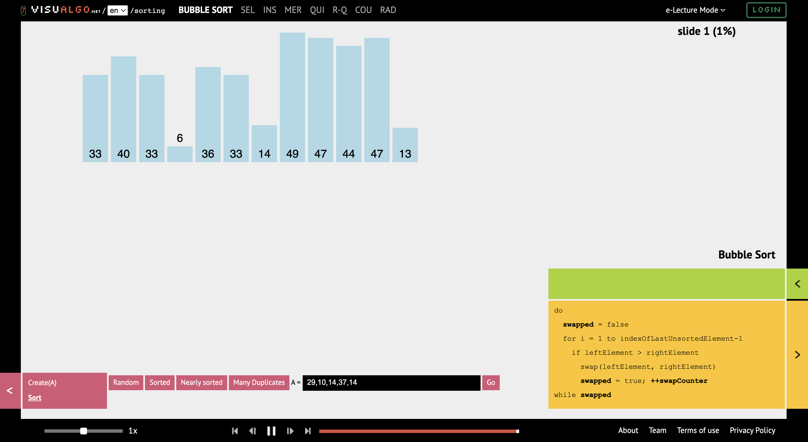

## Introduction

之後關於排序的章節非常推薦觀看此[網站](https://visualgo.net/en/sorting)的動畫演示。



一種排序資料的方式，實務上不太常使用，除了某些特定情境。相對於其他排序方式，Bubble Sort 效能較差。

Bubble Sort 實作上是一一比對兩兩相鄰的資料，假設排序要求從小到大排序數字，較大數字會與較小數字交換位置使得較大數字在後面。

以 `[30, 5, 1, 31, 10, 9, 2, 3, 4, 8, 7, 6]` 來說：
1. 第一次比對：30 與 5，30 較大，交換位置，為 `[5, 30, 1, 31, 10, 9, 2, 3, 4, 8, 7, 6]`
2. 第二次比對：30 與 1，30 較大，交換位置，為 `[5, 1, 30, 31, 10, 9, 2, 3, 4, 8, 7, 6]`
3. 第三次比對：30 與 31，31 較大，位置不變，為 `[5, 1, 30, 31, 10, 9, 2, 3, 4, 8, 7, 6]`

以此類推，排到最後一組時，最大的數字會在最後面，此時一個數字排序完成。
再來從頭再一輪比對，直到所有數字排序完成。

## Practice 1 - Bubble Sort

依據以上範例，實作 Bubble Sort：

```js
function bubbleSort(arr) {
  for (let i = 0; i < arr.length - 1; i++) {
    // 這個迴圈代表每輪排序會有幾次比對，隨著排序好的數字越多，剩下的數字比對的次數越少。
    // arr.length - 1 是因為 12 個數字最多會有 11 次兩兩比對，以此類推，下一輪剩 11 個數字尚未排序，所以會有 10 次兩兩比對。
    console.log('Turn', i)
    for (let j = 0; j < arr.length - 1 - i; j++) {
      // arr.length - 1 - i 是因為，隨著 i 越大，所需排序比對的數字就越少
      // 還要再 - 1 是因為兩兩比對的關係，要保留最後一個數字。否則最後一次比對會變成數字 比 undefined。
      console.log(`${arr[j]} ${arr[j + 1]}`);
      if (arr[j] > arr[j + 1]) {
        console.log(`swap!`);
        const temp = arr[j]
        arr[j] = arr[j + 1]
        arr[j + 1] = temp
      }
    }
  }
  return arr   
}
```

可以觀察 `console.log` 的結果，隨著每輪推進，比對次數會越來越少。

```
...
Turn 6
1 2
2 3
3 4
4 5
5 6
Turn 7
1 2
2 3
3 4
4 5
...
```

而可以發現到 Turn 6 之後順序基本上就沒變了，在這情境中，我們可以做些優化：

- 假設目前這一輪排序中，都沒有交換，那麼代表目前順序都是正確的，之後就不用再比對了。
- 所以我們定義一個變數 `hasSwapped`，變數會記錄這輪是否有交換過。
- 每輪剛開始將 `hasSwapped` 設 `false`。
- 若有交換時，將 `hasSwapped` 設 `true`。
- 每輪結束時檢查 `hasSwapped`，若是 `false`，代表順序已經排好，可以直接跳出迴圈。

## Practice 2 - Bubble Sort Optimized version

接下來根據上述優化條件來實作吧！

<details>
  <summary>Solution</summary>

  ```js
  function bubbleSort(arr) {
    let hasSwapped = false
    for (let i = 0; i < arr.length - 1; i++) {
      hasSwapped = false
      console.log('Turn', i)
      for (let j = 0; j < arr.length - 1 - i; j++) {
        console.log(`${arr[j]} ${arr[j + 1]}`);
        if (arr[j] > arr[j + 1]) {
          console.log(`swap!`);
          const temp = arr[j]
          arr[j] = arr[j + 1]
          arr[j + 1] = temp
          hasSwapped = true
        }
      }
      if (!hasSwapped) {
        break
      }
    }
    return arr
  }
  ```

  而最後 `console.log` 的結果在 Turn 6 過後果然就停止迴圈回傳結果了。
</details>