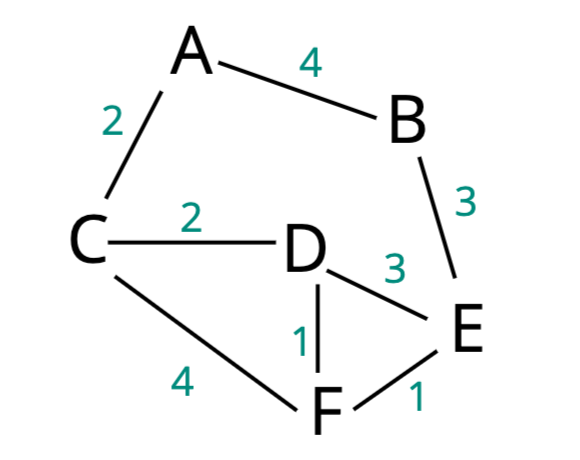

## Introduction

> 在學習 Dijkstra's Algorithm 需前理解資料結構的 [Priority Queue](../03-data-structures/08-priority-queue.md) 與 [Graph](../03-data-structures/10-graph.md) 。

而此演算法是由一位叫 Edsger Dijkstra 的荷蘭工程師所發明，他在電腦科學領域[貢獻了許多](https://en.wikipedia.org/wiki/Edsger_W._Dijkstra#Pioneering_contributions_and_impact_on_computing_science)奠定目前網際網路、電腦科學與數位服務等等的基礎。

而 Dijkstra's Algorithm 正是用他的名字來命名，此演算法是用於找出在 Graph 中兩個節點之間的最短路徑。

由於找最短路徑的應用場景中，每兩個節點之間的距離可能都會不一樣，所以我們需要先實作一個 Weighted Graph 。

## Weighted Graph

```js
class WeightedGraph {
  constructor() {
    this.adjacencyList = {}
  }
  addVertex(vertex){
    if(!this.adjacencyList[vertex]) this.adjacencyList[vertex] = []
  }
  addEdge(vertex1, vertex2, weight){
    if (this.adjacencyList[vertex1] && this.adjacencyList[vertex2]) {
      this.adjacencyList[vertex1].push({node: vertex2, weight})
      this.adjacencyList[vertex2].push({node: vertex1, weight})
    }
  }
}
```

刪除的部分可參考 [Graph](../03-data-structures/10-graph.md) 章節。

## Pseudo Code



## Priority Queue

而找尋當前哪個節點擁有最短路徑這部分可以使用 [Priority Queue](../03-data-structures/08-priority-queue.md) 來實作，每次加進去時，會依照其優先度調整順序，之後要找最短路徑時只要拿第一個就好了。

用此資料結構也能有效降低時間複雜度，若用陣列找尋最小值的話每次都需要遍歷整個陣列 - O(n) ， Priority Queue 則是在調整順序時只需 - O(log n) 。

```js
class Node {
  constructor(val, priority){
    this.val = val
    this.priority = priority
  }
}
class PriorityQueue {
  constructor(){
      this.values = []
  }
  enqueue(val, priority){
    let newNode = new Node(val, priority)
    this.values.push(newNode)
    this.bubbleUp()
  }
  bubbleUp(){
    let idx = this.values.length - 1
    const element = this.values[idx]
    while(idx > 0){
      let parentIdx = Math.floor((idx - 1)/2)
      let parent = this.values[parentIdx]
      if(element.priority >= parent.priority) break
      this.values[parentIdx] = element
      this.values[idx] = parent
      idx = parentIdx
    }
  }
  dequeue(){
    const min = this.values[0]
    const end = this.values.pop()
    if(this.values.length > 0){
      this.values[0] = end
      this.sinkDown()
    }
    return min
  }
  sinkDown(){
    let idx = 0
    const length = this.values.length
    const element = this.values[0]
    while(true){
      let leftChildIdx = 2 * idx + 1
      let rightChildIdx = 2 * idx + 2
      let leftChild,rightChild
      let swap = null

      if(leftChildIdx < length){
        leftChild = this.values[leftChildIdx]
        if(leftChild.priority < element.priority) {
          swap = leftChildIdx
        }
      }
      if(rightChildIdx < length){
        rightChild = this.values[rightChildIdx]
        if(
          (swap === null && rightChild.priority < element.priority) || 
          (swap !== null && rightChild.priority < leftChild.priority)
        ) {
          swap = rightChildIdx
        }
      }
      if(swap === null) break
      this.values[idx] = this.values[swap]
      this.values[swap] = element
      idx = swap
    }
  }
}
```
