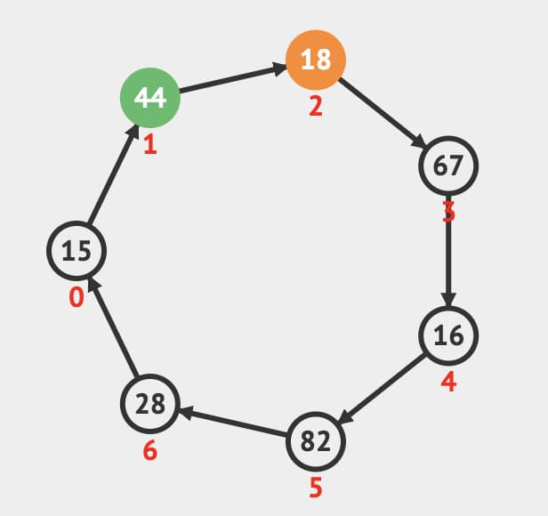
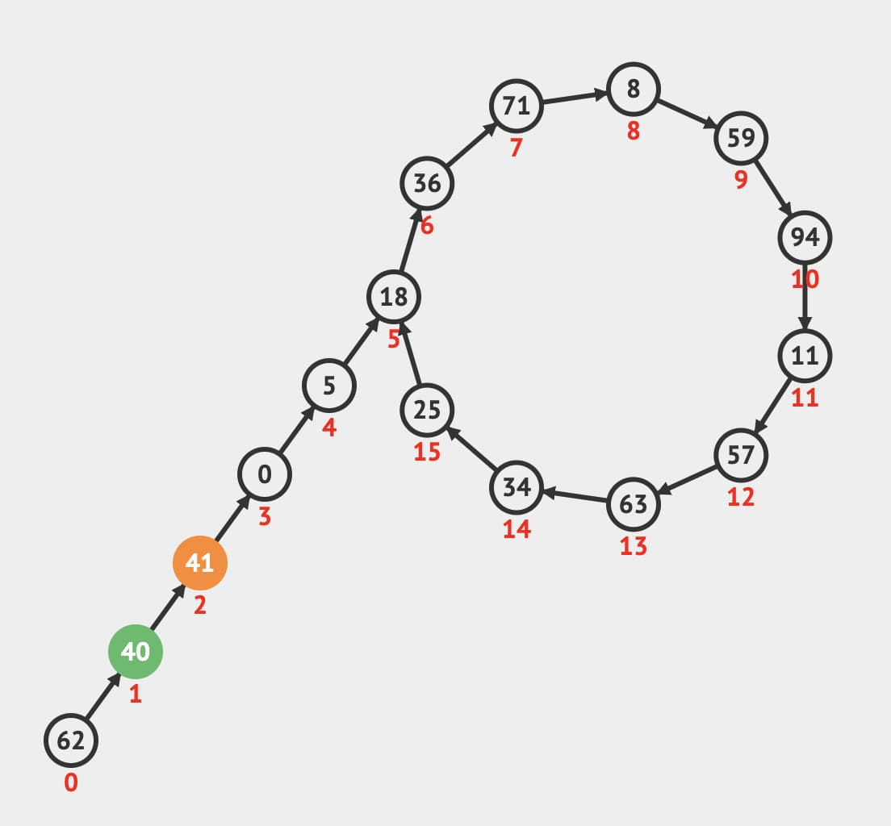
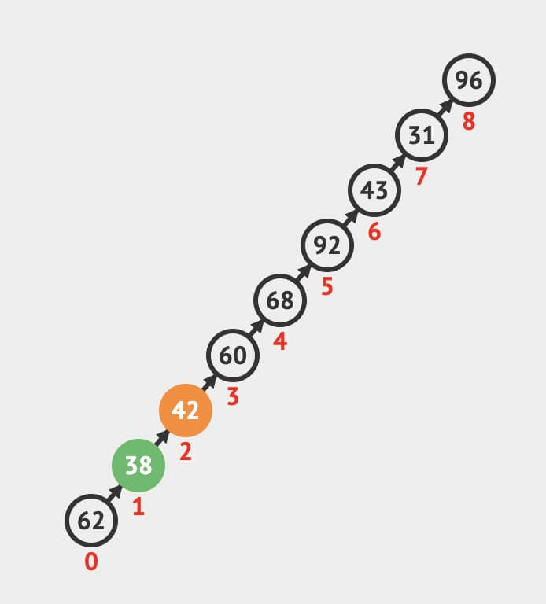

Floyd 判圈算法 (Floyd Cycle Detection Algorithm)，又稱龜兔賽跑算法 (Tortoise and Hare Algorithm)。
是一個可在序列資料或迭代函式中使用並找出是否有**環形結構**、**環長度**與**起點**的演算法。

:::tip
推薦觀看此[教學網站](https://visualgo.net/en/cyclefinding)的動畫演示。
:::

以下考慮我們可能遇到的三種資料圖形：

## Implement

使用 [Multiple Pointers](./06-multiple-pointers.md) 的技巧，建立兩個指針，一個每次只走一格，另個走兩格。就像烏龜 (Tortoise) 與兔子 (Hare) 一樣。

### 是否有環形結構

如果是遇到有環形的資料的話，最後兔子一定會倒追到烏龜並相遇在某個點上。如果沒有環形，兔子最後會走到底 (`null`)，類似 [Linked List](../03-data-structures/01-singly-linked-list.md) 最後一個節點的 `next` 是指向 `null` 。

### 環長度

兔子與烏龜兩個指針相遇後，其中一個停止移動，另個再走一次直到兩個再相遇，所需的步數就是這個環的長度。

### 起點

找起點的方式延續上面的步驟，兔子與烏龜目前在環上某個點相遇，把其中一個指針移到最一開始的節點上，另個待在原地。接著兩個同時往前每次走一格，直到相遇時該節點就是起點。
