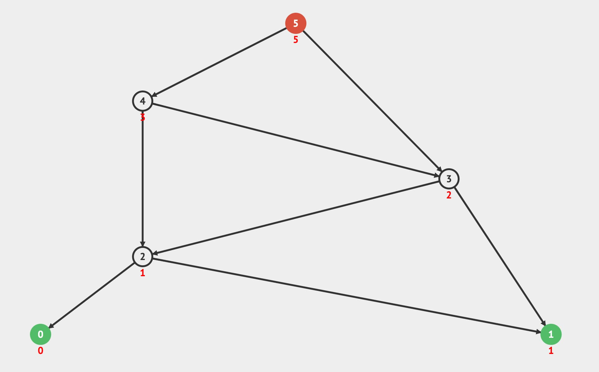

## Fundamental

Kahn’s algorithm 是一種用於 [Topological Sorting](./28-topological-sorting.md) 的算法，它使用廣度優先搜索 (BFS) 來對有向無環圖 (DAG) 進行排序。



一樣以課程選修舉例，想要修 A 課程得先要修 B 和 D 課程，而想要修 D 課程得先修 C 課程，想要修 F 課程得要先修 C 和 E 課程，想要修課程 C 得要先修課程 G。

```
A <- B, D
D <- C
F <- C, E
C <- G
```

是不是比[上篇](./28-topological-sorting.md)舉例還複雜一點？

這類依賴關係又可以稱為 In-Degree & Out-Degree，例如課程 A 的 In-Degree 為 2，因為課程 A 需要先修完課程 B 和 D，而課程 A 的 Out-Degree 為 0，因為沒有任何課程依賴課程 A 。

再來一個，課程 C 的 In-Degree 為 1，因為想要進到課程 C 需要先修完課程 G，而課程 C 的 Out-Degree 為 2，因為 D 和 F 課程依賴課程 C 。

## Implementation

Kahn’s algorithm 的步驟如下：

1. 遍歷每個邊，計算每個節點的 In-Degree。
2. 將所有 In-Degree 為 0 的節點加入 Queue，代表這些節點沒有任何的前置課程。
3. 從 Queue 中取出一個節點，並將其加入結果中。
4. 將該節點的所有後續節點的 In-Degree 減 1。
5. 如果後續節點的 In-Degree 被減至 0，代表此節點的前置課程都已經加入到結果中(已經修過)，則將其加入 Queue。
6. 重複步驟 3、4、5，直到 Queue 為空。

```js
class Graph {
  constructor() {
    this.adjacencyList = {};
  }

  addVertex(vertex) {
    if (!this.adjacencyList[vertex]) {
      this.adjacencyList[vertex] = [];
    }
  }

  addEdge(vertex1, vertex2) {
    this.adjacencyList[vertex1].push(vertex2);
  }

  kahnAlgorithm() {
    const inDegree = {};
    const queue = [];
    const result = [];

    for (const vertex in this.adjacencyList) {
      inDegree[vertex] = 0;
    }

    for (const vertex in this.adjacencyList) {
      for (const neighbor of this.adjacencyList[vertex]) {
        inDegree[neighbor]++;
      }
    }

    for (const vertex in inDegree) {
      if (inDegree[vertex] === 0) {
        queue.push(vertex);
      }
    }

    while (queue.length > 0) {
      const vertex = queue.shift();
      result.push(vertex);

      for (const neighbor of this.adjacencyList[vertex]) {
        inDegree[neighbor]--;
        if (inDegree[neighbor] === 0) {
          queue.push(neighbor);
        }
      }
    }

    // Check for cycle
    if (result.length !== Object.keys(this.adjacencyList).length) {
      console.log('Graph contains cycle!');
      return [];
    }

    return result;
  }
}
```

這裡多加了檢查是否有環的步驟，如果結果的長度不為節點數量，代表有環。

## Big O Complexity

| Time Complexity (Best) | Time Complexity (Average) | Time Complexity (Worst) | Space Complexity | Space Complexity (Worst) |
| ---------------------- | ------------------------- | ----------------------- | ---------------- | ------------------------ |
| *O(V + E)*             | *O(V + E)*                | *O(V + E)*              | *O(V)*           | *O(V)*                   |

- V: 節點數量
- E: 邊數量

在 Kahn’s algorithm 中，我們需要遍歷每個節點來初始化 `inDegree`，這裡時間複雜度為 `O(V)`，接著遍歷每個邊來更新 `inDegree`，這裡時間複雜度為 `O(E)`，再來遍歷每個節點來找出 In-Degree 為 0 的節點並放入 `queue`，這裡時間複雜度為 `O(V)`，當 `queue` 不為空時，我們需要遍歷 `queue` 中的每個節點，這裡時間複雜度為 `O(V)`，而我們在迴圈中會根據 `inDegree` 的數量來不斷更新每個節點的 `inDegree` 直到為 0，並丟入 `queue` 中，這裡時間複雜度為 `O(E)`，所以總時間複雜度為 `O(V + E)`。

空間複雜度方面，我們需要一個 `inDegree` 來記錄每個節點的 In-Degree，這裡空間複雜度為 `O(V)`，再來還需要一個 `queue` 來存放 In-Degree 為 0 的節點，這裡空間複雜度為 `O(V)`，再來還需要一個 `result` 來存放排序後的節點，這裡空間複雜度為 `O(V)`，所以總空間複雜度為 `O(V)`。

## Testcase

```js
const graph = new Graph();
graph.addVertex('A');
graph.addVertex('B');
graph.addVertex('C');
graph.addVertex('D');
graph.addVertex('E');
graph.addVertex('F');
graph.addVertex('G');
graph.addEdge('B', 'A');
graph.addEdge('D', 'A');
graph.addEdge('C', 'D');
graph.addEdge('C', 'F');
graph.addEdge('E', 'F');
graph.addEdge('G', 'C');

console.log(graph.kahnAlgorithm());
// ['B', 'E', 'G', 'C', 'D', 'F', 'A']
```

## Practice

在 LeetCode 使用到 Topological Sorting 的題目有：

- [207. Course Schedule](https://leetcode.com/problems/course-schedule/)
- [210. Course Schedule II](https://leetcode.com/problems/course-schedule-ii/)
