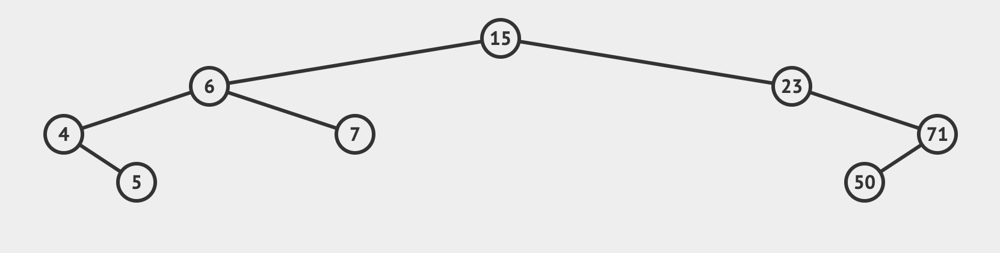
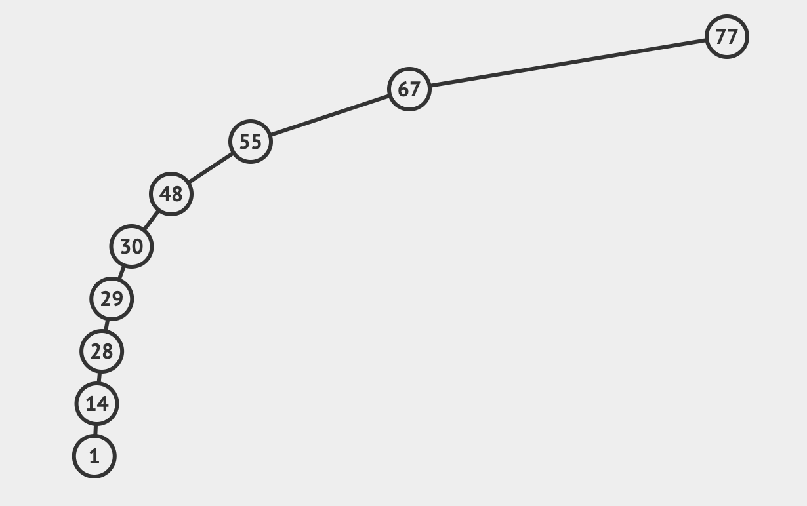

一種樹狀資料結構，含有根節點與子節點，每個節點彼此是親子的關聯。



1. Root: 根節點，樹狀資料結構的第一個的節點。
2. Child: 子節點，具有父節點。
3. Parent: 具有子節點的節點。
4. Siblings: 兄弟節點，具有同個父節點。
5. Leaf: 沒有子節點的節點。
6. Edge: 兩個節點彼此的關聯。

下列兩種情況不是樹狀結構：

1. 具有兩個根節點。
2. 關聯指向相鄰的兄弟節點。

而像網頁的 HTML DOM 就是一種樹狀結構，從 `document` , `body` 到各種標籤元素，都具有父子關係。
電腦本身的資料夾結構也是。

而樹的的種類有[非常多樣](https://en.wikipedia.org/wiki/List_of_data_structures#Trees)，除了上述定義的廣泛樹狀結構，其中衍生出基本的兩項：

Binary Tree - 每個節點的子節點最少零個，至多兩個 (left 、 right)。
Binary Search Tree - Binary Tree 衍生而來，每個節點之間有特定順序，左邊的子節點的值一定小於其父節點，右邊子節點的值一定大於其父節點。

## Implementation

```js
class Node {
  constructor(value) {
    this.value = value;
    this.left = null;
    this.right = null;
  }
}

class BinarySearchTree {
  constructor() {
    this.root = null
  }
}
```

上述定義最基本的節點與樹狀類別。

## Insert

接著來定義 Insert 方法，將節點插入 Binary Search Tree 中正確的位置。

若沒有根節點，則直接賦予。

若有則依照上面提到 Binary Search Tree 的規則往下比對，

若插入的值比當前的父節點大 (從最開始父節點是根節點)，則往右，反之則往左，

若當前父節點沒有左 (或右) 子節點，則直接賦予，反之則繼續往下尋找空的位置。

而如果遇到新節點的值已經跟既有的節點的值一樣，處理的方式有很多，取決於當下的情境，像是每個節點多一個 `count` 屬性來紀錄重複多少次等等。

但目前我們先回傳 `undefined` 即可。

```js
insert(value) {
  const node = new Node(value)
  if (this.root === null) {
    this.root = node
    return this;
  } else {
    let current = this.root
    while (true) {
      if (value === current.value) return undefined
      if (value < current.value) {
        if (current.left === null) {
          current.left = node
          return this
        } else {
          current = current.left
        }
      } else {
        if (current.right === null) {
          current.right = node
          return this
        } else {
          current = current.right
        }
      }
    }
  }
}
```

## Find

接著定義 Find 方法，找尋有無該值，回傳布林值。

一樣的概念，先看根節點，然後依比大小後的結果往左或往右找。

```js
find(value) {
  if (this.root === null) return false
  let current = this.root
  let found = false
  while (current && !found) {
    if (value < current.value) {
      current = current.left
    } else if (value  current.value) {
      current = current.right
    } else {
      return true
    }
  }
  return false
}
```

## Big O Complexity

|  | Insertion | Search |
|---|---|---|
| Best & Average | O(log n) | O(log n) |
| Worse | O(n) | O(n) |

在最好與平均情況下，每次往下一層尋找時都可以濾掉最多一半的節點。

在最壞的情況下，子節點都集中在同一邊造成每次尋找都只能濾掉當前的節點而已。


