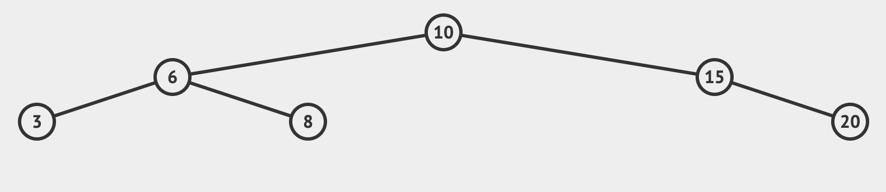

## Introduction

由於樹狀結構並不像 Lined List 或陣列那樣是線狀的，故需要遍歷整個樹狀結構是很複雜的，而且有多種方式。

大致上分為以下兩種：

1. Breadth-first Search (廣度優先搜尋)
2. Depth-first Search (深度優先搜尋)

而 Depth-first Search 依照搜尋順序不同又分為：

1. Pre-order (NLR) 父節點 -> 左節點 -> 右節點
2. Post-order (LRN) 左節點 -> 右節點 -> 父節點
3. In-order (LNR) 左節點 -> 父節點 -> 右節點

## Breadth First Search

此搜尋方式是每層每層遍歷，根節點遍歷之後換根節點的左右子節點，接著換左右子節點的左右子節點，接著遍歷下去直到沒有子節點。


> [Image From hackerearth.com](https://www.hackerearth.com/practice/algorithms/graphs/breadth-first-search/tutorial/)

而實作上我們需要建立一個 Queue 與一個遍歷完存放節點的物件，這兩個都可以用陣列達成。

第一步先將根節點放入 Queue 中，接著開始遞迴查找當前 Queue 拿出來的節點底下是否有左右節點，有的話就放到 Queue 裡面等待查詢，

由於根節點 (當前節點) 已經查找過了，除了從 Queue 拿出來之外，也要放入遍歷完存放節點的陣列中，此陣列是最後遞迴結束時要回傳的最終結果。

再來一樣的步驟，從 Queue 拿出來節點當作當前節點，查找當前節點底下是否有左右節點，有的話就放到 Queue 裡面等待查詢，接著把當前節點放入遍歷完存放節點的陣列。

當 Queue 裡面都沒有節點時，迴圈結束，回傳結果。

以下圖樹狀資料為例：



1. 首先放 root 進 Queue ，並開始遞迴查找：

`queue: [10], result: []`

2. 從 Queue 取出節點，設成當前節點，查找當前節點是否有左右子節點，並放到 Queue 裡：

`queue: [6, 15], result: [], current: 10`

3. 查找完後將當前節點放入 Result 內，並繼續遞迴直到 Queue 裡面沒有節點為止：

`queue: [6, 15], result: [10], current: 10`

4. 照著步驟二邏輯取出 `6` ，查找左右子節點，並放到 Queue 裡：

`queue: [15, 3, 8], result: [10], current: 6`

`queue: [15, 3, 8], result: [10, 6], current: 6`

5. 繼續從取出節點，查找節點底下，子節點放入 Queue 等待查找，當前節點放入 Result 。

`queue: [3, 8, 20], result: [10, 6], current: 15`

`queue: [3, 8, 20], result: [10, 6, 15], current: 15`

6. 同樣步驟，當前節點底下沒節點就放入 Result 。：

`queue: [8, 20], result: [10, 6, 15, 3], current: 3`

7. 繼續：

`queue: [20], result: [10, 6, 15, 3, 8], current: 8`

8. 由於此次取出之後 Queue 裡面就沒節點了，所以沒有下個迴圈，最後回傳 Result：

`queue: [], result: [10, 6, 15, 3, 8, 20], current: 20`

<details>
  <summary>Implementation</summary>

  ```js
  breadthfirstSearch() {
    const data = []
    const queue = []
    let node = this.root
    queue.push(node)

    while(queue.length) {
      node = queue.shift()
      data.push(node.value)
      if (node.left) queue.push(node.left)
      if (node.right) queue.push(node.right)
    }

    return data
  }
  ```

</details>

## Depth First Search - PreOrder
## Depth First Search - PostOrder
## Depth First Search - InOrder


## Big O Complexity

<!-- |  | Insertion | Search |
|---|---|---|
| Best & Average | O(log n) | O(log n) |
| Worse | O(n) | O(n) | -->
