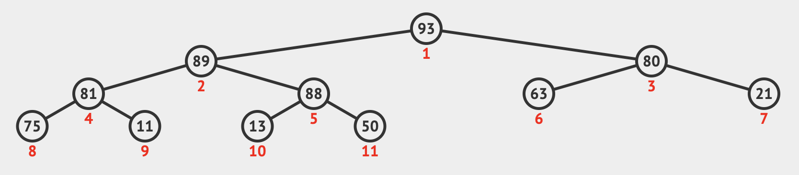
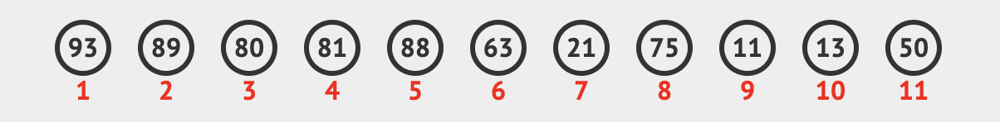
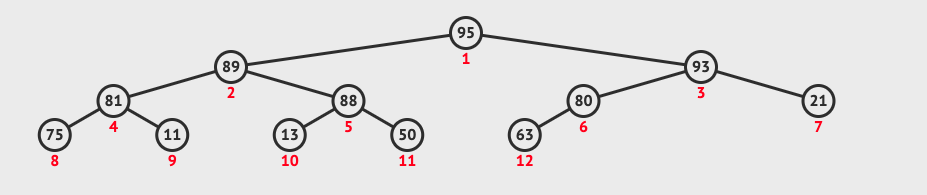
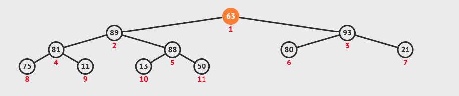

## Introduction

Binary Heap 和 [Binary Search Tree](./05-binary-search-tree.md) 很類似，但規則上有些不同。

有兩種 Binary Heap ：
- Max Binary Heap - 父節點永遠比子節點大
- Min Binary Heap - 子節點永遠比父節點大

>
像上圖就是屬於 Max Binary Heap

而 Max Binary Heap 的規則就只管父節點比子節點大而已，就算某個子節點比父節點的相鄰節點大也沒關係。

還有另個與 [Binary Search Tree](./05-binary-search-tree.md) 不同的規則是，加新節點時，一律往左邊先加，左邊有了加右邊，同層都滿了就到下一層的最左邊開始加。

Binary Heap 可用來實作 Priority Queues，也會在之後會寫到的 Graph Traversal 用到。

## Storing Heap

而也因為必須先加左再加右，同層滿了才可以往下加的規則，所以我們可以為每個節點標記 Index 順序，而存成陣列的形式。

>延續上張圖的 Binary Heap


這邊可以觀察出一些規則：
- Index 為 N 的節點，其左右子節點會位於 2N + 1 與 2N + 2 的位置。
- 反之， Index 為 N 的節點，其父節點會位於 (N-1) / 2 取整數 (floor) 的位置

## Implementation

由於上述的規則，我們可以將節點們存成陣列形式即可。

```js
class MaxBinaryHeap {
  constructor() {
    this.values = []
  }
}
```

## Insert

新增節點時，我們會將其加在最後面。

沿用上圖例子來說，新增一個 `95` ：
- 加在最後面 - `[93, 89, 80, 81, 88, 63, 21, 75, 11, 13, 50, 95]`
- 然後我們需要找到 `95` 的父節點來比大小，這邊可以用上面有提到的 (N-1) / 2 取整數 (floor) 方法來找到
- `95` 比其父節點 `63` 大，故兩個需要交換位置
- 
- 交換後， `95` 比新父節點 `80` 大，故兩個需要交換位置
- 交換後， `95` 比新父節點 `93` 大，故兩個需要交換位置
- 交換後，已經在根節點的位置 (0) 了，所以結束。
- 

若是比父節點小，就可以直接結束。

```js
insert(element) {
  this.values.push(element)
  this.bubbleUp()
  return this.values
}
bubbleUp() {
  let currentIndex = this.values.length - 1
  const newElement = this.values[currentIndex]

  while (currentIndex > 0) {
    let parentIndex = Math.floor((currentIndex - 1) / 2)
    let parentElement = this.values[parentIndex]
    if (newElement <= parentElement) break
    this.values[parentIndex] = newElement
    this.values[currentIndex] = parentElement
    currentIndex = parentElement
  }
}
```

## ExtractMax

接著來實作移除根節點 (最大值) 的方法。

步驟如下：
- 將最後一個節點與根節點交換位置
- 將最後一個節點移除
- 
- 將新的根節點與其左右子節點比對
- 若比左右子節點小則與其交換位置 (若同時比左右都小，則挑左右之中最大的節點交換位置)
- 直到比左右子節點都大或是已經沒有左右子節點為止
- 

若移除根節點後就沒有其他節點了，就直接回傳被移除的節點，不用再做比對交換。

```js
extractMax() {
  const maxElement = this.values[0]
  const lastElement = this.values.pop()
  if (this.values.length > 0) {
    this.values[0] = lastElement
    this.sinkDown()
  }
  return maxElement
}
sinkDown() {
  let currentIndex = 0
  const element = this.values[currentIndex]
  let leftIndex = 2 * currentIndex + 1
  let rightIndex = 2 * currentIndex + 2

  while (leftIndex < this.values.length || rightIndex < this.values.length) {
    let leftElement = this.values[leftIndex]
    let rightElement = this.values[rightIndex]

    let swapLeft = false
    let swapRight = false
    if (element < leftElement) swapLeft = true
    if (element < rightElement) swapRight = true
    if (swapLeft && swapRight) {
      if (leftElement > rightElement) {
        swapRight = false
      } else {
        swapLeft = false
      }
    }

    if (swapLeft) {
      this.values[leftIndex] = element
      this.values[currentIndex] = leftElement
      currentIndex = leftIndex
    } else if (swapRight) {
      this.values[rightIndex] = element
      this.values[currentIndex] = rightElement
      currentIndex = rightIndex
    } else {
      break
    }

    leftIndex = 2 * currentIndex + 1
    rightIndex = 2 * currentIndex + 2
  }
}
```