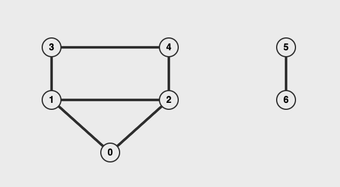
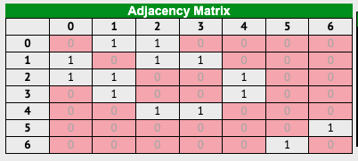
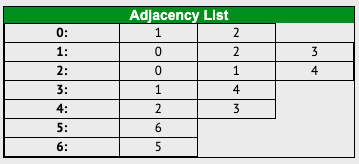

## Introduction

簡言之， Graph 就是很多個節點與節點之間的連線所組成的，與前幾篇提到的 [Three](./05-binary-search-tree.md) 也算是 Graph 的一種 ， Graph 主要有以下幾點特色：
- Graph 沒有特定的根節點
- 節點之間的連線可以有或沒有方向性
- 一個節點可以任意與多個節點連線
- 節點之間的連線可以有權重 (例如地圖上兩個景點間的連線距離)

Graph 是目前最廣泛應用的資料結構之一，在社群網路、地圖與路線演算法、推薦廣告等等都可以用到。

當提到 Graph 時有幾點名詞與用途也要介紹一下：
- Vertex - 節點
- Edge - 節點之間的連線
- Undirected - 節點之間的連線**沒有方向性** (雙向)
- Directed - 節點之間的連線**有方向性** (單向或雙向)
- Weighted - 節點之間的連線**有權重**
- Unweighted - 節點之間的連線**沒有權重**

在實作前先來介紹兩種存 Graph 資料的方式：
1. Adjacency Matrix (相鄰矩陣)
2. Adjacency List (相鄰列表)

## Storing Graph - Adjacency Matrix





[來源](https://visualgo.net/en/graphds)

上圖範例為 Undirected 與 Unweighted 的 Graph ， Adjacency Matrix 以表格的方式來表示每個節點之間有無連線，有的話寫 1 、沒有的話寫 0 (要用 `true` 、 `false` 也可，只要能表示有無的就行)。

寫成程式碼會像這樣：

```js
const adjacencyMatrix = [
  [0, 1, 1, 0, 0, 0, 0],
  [1, 0, 1, 1, 0, 0, 0],
  [1, 1, 0, 0, 1, 0, 0],
  [0, 1, 0, 0, 1, 0, 0],
  [0, 0, 1, 1, 0, 0, 0],
  [0, 0, 0, 0, 0, 0, 1],
  [0, 0, 0, 0, 0, 1, 0],
]
```

在程式上由於我們存的節點資料有可能是物件之類的資料，不會是像上面純數字，所以我們可以用其資料的 ID ，或是自己產個字串當作 Key 來存成物件形式。

```js
//       Jason  Allan  Kevin  Alex  Vicky
// Jason   0      1      1      1     0
// Allan   1      0      1      0     0
// Kevin   1      1      0      0     0
// Alex    1      0      0      0     0
// Vicky   0      0      0      0     0

const adjacencyMatrix = {
  Jason: { Allan: true, Kevin: true, Alex: true, Vicky: false },
  Allan: { Jason: true, Kevin: true, Alex: false, Vicky: false },
  Kevin: { Jason: true, Allan: true, Alex: false, Vicky: false },
  Alex:  { Jason: true, Allan: false, Kevin: false, Vicky: false },
  Vicky: { Jason: false, Allan: false, Kevin: false, Alex: false },
}
```

Adjacency Matrix 重點在於就算某個節點沒有跟其他節點連線，也要存是否與其他節點連線的變數。

如 `Vicky` 都沒跟其他人有連線，但還是需要在自己的表格裡存有其他節點的名稱並標注 `false` 。

## Storing Graph - Adjacency List




[來源](https://visualgo.net/en/graphds)

上圖範例為 Undirected 與 Unweighted 的 Graph ， Adjacency List 以列表的方式來表示每個節點之間有無連線，有的話才會出現在列表內，反之則不在。

寫成程式碼會像這樣：

```js
const adjacencyList = [
  [1, 2],
  [0, 2, 3],
  [0, 1, 4],
  [1, 4],
  [2, 3],
  [6],
  [5],
]
```

而用字串當 Key 存成物件形式的話則會像這樣：

```js
const adjacencyList = {
  'Jason': [ 'Allan', 'Kevin', 'Alex' ],
  'Allan': [ 'Jason', 'Kevin' ],
  'Kevin': [ 'Jason', 'Allan' ],
  'Alex':  [ 'Jason' ],
  'Vicky': [],
}
```

Adjacency List 重點在於只存有關聯的節點，有關連的節點才會在該節點的關係列表中出現。

如 `Vicky` 都沒跟其他人有連線，所以他的列表就是空的。

## Big O Complexity with Adjacency Matrix & List
