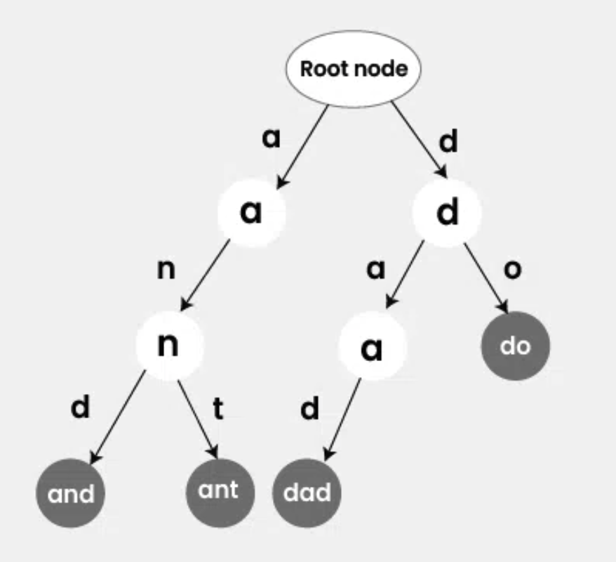

Trie 常用於字串的查詢和搜尋推薦的自動完成功能 (auto complete)，讀音同 Try。

前幾篇提到的 [Three](./05-binary-search-tree.md) 中每個節點最多只有兩個子節點。但是 Trie 中每個節點最多有 N 個子節點，其中 N 是字符的種類數量，以下為了簡單講解會先以英文為例。

## Fundamental

英文共有 26 個字母，所以每個 Trie 節點最多有 26 個子節點，每個節點本身會代表一個字符。

例如： 將 'apple' 這個字加入 Trie 中，最終 `a` 節點底下會有 `p` 節點，`p` 節點底下會有 `p` 節點，`p` 節點底下會有 `l` 節點，`l` 節點底下會有 `e` 節點，因為 `e` 節點是這個字的最後一個，所以 `e` 節點的 `isEnd` 為 `true`。

至於為何要特別設置一個 `isEnd` 的屬性呢，假設現在插入一個單字是 'apple'，接著我想搜尋是否有 'app' 這個單字，如果沒有 `isEnd` 屬性的話，就沒法判斷這個單字有沒有插入過。

```js
class TrieNode {
  constructor(value) {
    this.value = value;
    this.children = new Map(); // 也可以使用陣列或物件，但是 Map 在插入和刪除的效能會比較好
    this.isEnd = false;
  }
}

class Trie {
  constructor() {
    this.root = new TrieNode('');
  }
}
```

附上圖方便理解：



其中 Root Node 的 value 是空的，方便從頭搜尋與插入。

## Insert

遞迴要插入的字串的每個字符，在最後一個字符設置 `isEnd = true` 代表到這個位置時是一個完整的字串。

```js
class Trie {
  constructor() {
    this.root = new TrieNode('');
  }

  insert(word) {
    let currentNode = this.root
    for (let i = 0; i < word.length; i++) {
      if (!currentNode.children.has(word[i])) {
        currentNode.children.set(word[i], new TrieNode())
      }
      currentNode = currentNode.children.get(w)
    }
    currentNode.isEnd = true
  };
}
```

## Search

這裡的搜尋是指要匹配完整的字串，遞迴字串的每個字符到最後時檢查 `isEnd` 是否為 `true`。

```js
class Trie {
  constructor() {
    this.root = new TrieNode('');
  }

  search(word) {
    let currentNode = this.root
    for (let i = 0; i < word.length; i++) {
      if (!currentNode.children.has(word[i])) {
        return false
      }
      currentNode = currentNode.children.get(word[i])
    }
    if (currentNode.isEnd) {
      return true
    }
    return false
  };
}
```

## StartsWith

這裡只需要匹配完給定的 `word` 即可，不用檢查 `isEnd`。

這裡常用於搜尋推薦和自動完成功能 (auto complete)。

```js
class Trie {
  constructor() {
    this.root = new TrieNode('');
  }

  startsWith(word) {
    let currentNode = this.root
    for (let i = 0; i < word.length; i++) {
      if (!currentNode.children.has(word[i])) {
        return false
      }
      currentNode = currentNode.children.get(word[i])
    }
    return true
  };
}
```

## Delete

刪除就需要注意比較多細節了，首先要確定該字串之前有沒有插入過，接著往回做刪除。在刪除節點的同時需要考慮該節點是否同時為其他字串的子節點。

```js
class Trie {
  constructor() {
    this.root = new TrieNode('');
  }

  delete(word) {
    let currentNode = this.root
    const parents = [this.root]
    for (let i = 0; i < word.length; i++) {
      if (!currentNode.children.has(word[i])) {
        return null
      }
      currentNode = currentNode.children.get(word[i])
      parents.push(currentNode)
    }
    if (!currentNode.isEnd) {
      return null
    }

    if (currentNode.children.size > 0) {
      currentNode.isEnd = false
      return word
    }

    for (let i = parents.length - 2; i >= 0; i--) {
      const childNode = parents[i].children.get(word[i])
      if (childNode.children.size > 0 || childNode.isEnd) {
        return word
      }
      parents[i].children.delete(word[i])
    }
    return word
  };
}
```

## Implementation

完整實作可以看以下：

<details>
  <summary>Implementation</summary>

  ```js
  class TrieNode {
    constructor(value) {
      this.value = value;
      this.children = new Map();
      this.isEnd = false;
    }
  }

  class Trie {
    constructor() {
      this.root = new TrieNode('');
    }

    insert(word) {
      let currentNode = this.root
      for (let i = 0; i < word.length; i++) {
        if (!currentNode.children.has(word[i])) {
          currentNode.children.set(word[i], new TrieNode())
        }
        currentNode = currentNode.children.get(w)
      }
      currentNode.isEnd = true
    };

    search(word) {
      let currentNode = this.root
      for (let i = 0; i < word.length; i++) {
        if (!currentNode.children.has(word[i])) {
          return false
        }
        currentNode = currentNode.children.get(word[i])
      }
      if (currentNode.isEnd) {
        return true
      }
      return false
    };

    startsWith(word) {
      let currentNode = this.root
      for (let i = 0; i < word.length; i++) {
        if (!currentNode.children.has(word[i])) {
          return false
        }
        currentNode = currentNode.children.get(word[i])
      }
      return true
    };

    delete(word) {
      let currentNode = this.root
      const parents = [this.root]
      for (let i = 0; i < word.length; i++) {
        if (!currentNode.children.has(word[i])) {
          return null
        }
        currentNode = currentNode.children.get(word[i])
        parents.push(currentNode)
      }
      if (!currentNode.isEnd) {
        return null
      }

      if (currentNode.children.size > 0) {
        currentNode.isEnd = false
        return word
      }

      for (let i = parents.length - 2; i >= 0; i--) {
        const childNode = parents[i].children.get(word[i])
        if (childNode.children.size > 0 || childNode.isEnd) {
          return word
        }
        parents[i].children.delete(word[i])
      }
      return word
    };
  }
  ```
</details>

附上測試用例：

```js
const trie = new Trie();
trie.insert('apple');
trie.insert('app');
trie.insert('apples');

console.log(trie.search('apple'), true);
console.log(trie.search('app'), true);
console.log(trie.search('apples'), true);
console.log(trie.search('ap'), false);
console.log(trie.delete('appple'), null);
console.log(trie.delete('apple'), 'apple');
console.log(trie.search('apple'), false);
console.log(trie.search('app'), true);
console.log(trie.search('apples'), true);
console.log(trie.startsWith('app'), true);
console.log(trie.startsWith('apple'), true);
console.log(trie.startsWith('apples'), true);
```

## Big O Complexity

| Time Complexity (Insertion) | Time Complexity (Search) | Time Complexity (Deletion) | Space Complexity |
| --------------------------- | ------------------------ | -------------------------- | ---------------- |
| O(n)                        | O(n)                     | O(n)                       | O(n*k)           |

插入、搜尋、刪除的部分很單純，一個個字母做處理，時間複雜度都是 O(n)。

空間複雜度則是 O(n\*k)，其中 n 是存入的字串中最長的長度，k 是字符的種類數量。以上面純英文字母的範例，k 為 26，所以最多會有 n * 26 個節點。
